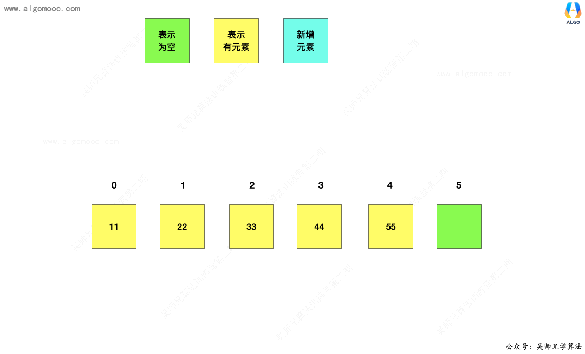
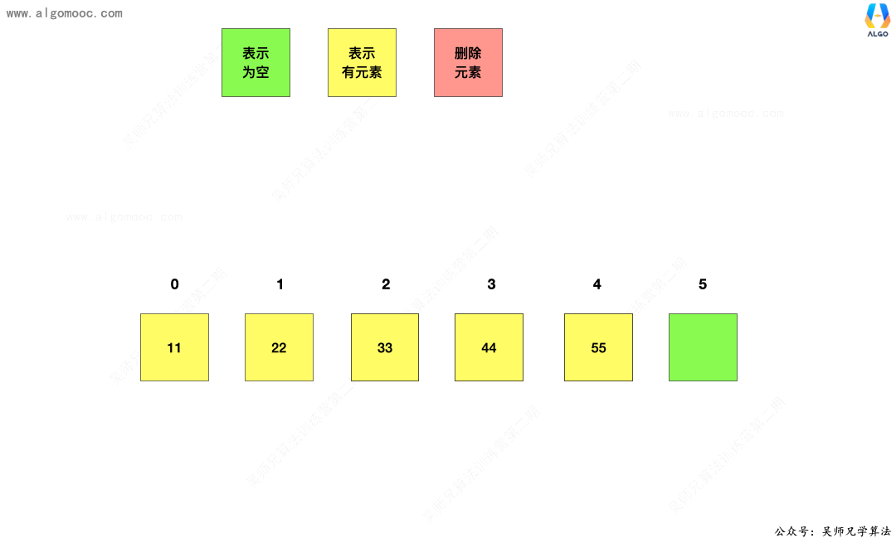
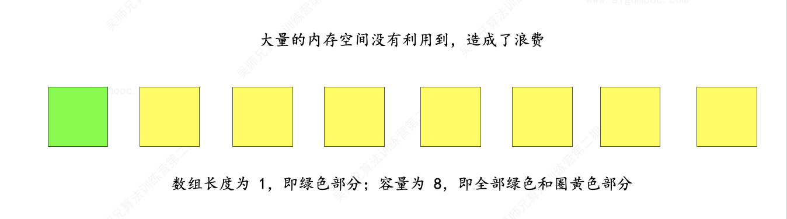

# 算法基础知识

## 一、时间复杂度

### 1.1 常数阶 O(1)

无论代码执行了多少行，只要是没有循环等复杂结构，那这个代码的时间复杂度就都是O(1)，如：

```python
int i = 1;
int j = 2;
++i;
j++;
int m = i + j;
```

上述代码在执行的时候，**它消耗的时候并不随着某个变量的增长而增长**，那么无论这类代码有多长，即使有几万几十万行，都可以用 O(1) 来表示它的时间复杂度。

### 1.2 对数阶O(logn)

```python
int i = 1;
while( i < n ){
    i = i * 2;
}
```

在 while 循环里面，每次都将 i 乘以 2，计算完之后，i 距离 n 就越来越近。

假设循环 x 次之后，i 就大于 n ，此时这个循环就退出，**也就是说 2 的 x 次方等于 n，那么 x = log2n。**

也就是说当循环 log2n 次以后，这个代码就结束，因此这个代码的时间复杂度为：**O(logn)**

### 1.3 线性阶 O(n)

```python
for( i = 1 ; i <= n ; i++){
   j = i ;
   j++ ;
}
```
这段代码，for 循环里面的代码会执行 n 遍，因此它消耗的时间是随着 n 的变化而变化的，因此这类代码都可以用 O(n) 来表示它的时间复杂度。

### 1.4 线性对数阶O(nlogn)

将时间复杂度为 O(logn)的代码循环 n 遍的话，那么它的时间复杂度就是 n * O(logn)，也就是O(nlogn)。

```python
for( int m = 1; m < n; m++ ){
    i = 1;
    while( i < n){
        i = i * 2;
    }
}
```

### 1.5 平方阶 O(n²)

平方阶O(n2) 就更容易理解了，如果把 O(n) 的代码再嵌套循环一遍，它的时间复杂度就是 O(n²) 。

```python
for( int x = 1; x <= n ; x++ ){
   for( i = 1 ; i <= n ; i++ ){
       ...
    }
}
```

这段代码嵌套了 2 层 n 循环，它的时间复杂度是 O(n*n)，即 O(n²) 。

一般来说，我们接触的大部分时间复杂度就是以上这 5 种，其它的比如 **立方阶 $O(n³)$、K次方阶 $O(n^k)$**  等等出现的频率较少，同时分析情况也和上述其它几种情况一样。


## 二、空间复杂度

空间复杂度是衡量算法在运行过程中临时占用存储空间大小的指标，通常用大O符号表示。它关注的是算法使用的额外空间（即除输入数据外），随输入规模增长的变化趋势。

### 2.1 关键点：

1. **常见空间复杂度**：
   - **O(1)**：常数空间，使用固定数量的变量（如循环中的临时变量）。
   - **O(n)**：线性空间，如分配长度为n的数组。
   - **O(n²)**：平方空间，如n×n的二维矩阵。
   - **O(log n)**：对数空间，常见于递归深度为对数的情况（如平衡树的遍历）。

2. **递归算法的空间复杂度**：
   - 由**递归深度**和**每层递归的额外空间**共同决定。
   - 例如，普通递归斐波那契数列的空间复杂度为O(n)（深度为n），而尾递归优化后可降至O(1)。

3. **动态规划与优化**：
   - 通过状态压缩（如仅保存必要的前驱状态）可将空间复杂度从O(n)优化至O(1)。

4. **原地操作**：
   - 如快速排序和反转数组的迭代实现，空间复杂度为O(1)，无需额外存储。

### 2.2 示例分析：
- **归并排序**：需额外O(n)空间合并子数组。
- **广度优先搜索（BFS）**：队列最大存储O(n)节点。
- **递归创建数组**：若每次递归分配递减数组（如n, n-1, …），总空间复杂度为O(n²)。

### 2.3 计算步骤：
1. **识别变量与数据结构**：确定算法中动态分配的结构（如数组、队列）。
2. **分析递归深度**：递归算法的栈空间与深度成正比。
3. **合并空间需求**：取最高阶项，忽略低阶和常数。

### 2.4 总结：
空间复杂度分析需结合算法实现细节，重点关注额外空间的使用趋势。优化方法包括减少数据结构大小、改用迭代替代递归或优化递归为尾递归。

## 三、什么是数据结构

数据结构研究的是数据如何在计算机中进行组织和存储，使得我们可以 **「高效」** 的获取数据或者修改数据。

这里，我们需要特别注意**高效**这个词，它暗示我们获取数据或者修改数据有很多种方式，但我们可以根据使用场景来选择**最合适**的数据结构，达到**高效**的目的。

一般来说，我们会接触三种数据结构：线性结构、树形结构、图形结构。

## 四、线性结构

**线性表**是具有 n 个**相同类型元素的有限序列**（ n ≥ 0 ）。

常见的线性表有：

+ 数组
+ 链表
+ 栈
+ 队列
+ 哈希表（也叫做散列表）

## 五、数组

数组是一种顺序存储的线性表，所有元素的**内存地址是连续的**，对于一维数组来说，把第一个数据元素存储到下标为 0 的位置中，把第 2 个数据元素存储到下标为 1 的位置中，以此类推。

基于这样的存储方式，数组具备一个很大的优点：**快速查询**，通过索引可以快速获取到需要查询的数据。

数组有个缺点： **无法动态修改容量。**


## 六、链表

### 6.1 简介

在数组的学习中，我们发现，想要在动态数组中执行 **插入** 和 **删除** 操作需要移动大量的元素。





于此同时，动态数组可能会造成内存空间的大量浪费。





那么，可不可以在不移动大量元素的基础上实现 **插入** 和 **删除** 操作呢？同时能不能用到多少数据就申请多少内存呢？

答案是可以的，那就是**链表**。

### 6.2 链表详解

**链表**是一种**链式存储**的线性表，所有元素的**内存地址不一定是连续的**，因为只有在每次新增数据的时候才会去申请内存地址，它是真正的动态数据结构。


链表 是由一个个 节点 组成，每个 节点 之间通过 链接关系 串联起来，每个 节点 都有一个 后继节点，最后一个 节点 的 后继节点 为 空节点。如下图所示：


基于这样的特性，链表具备以下两个显著的特点：

1、**优点**，真正的动态，不需要处理固定容量的问题

2、**缺点**，丧失了随机访问的能力，无法像数组那样，给定一个索引，立马获取到元素


### 6.3 设计单链表

和设计动态数组一样的思路，我们设计一下单链表，定义为 **LinkedList**，它具备以下的功能：

+ 1、获取链表中的元素个数
+ 2、判断链表是否为空
+ 3、在链表头添加元素
+ 4、在链表中间添加元素
+ 5、在链表尾部添加元素
+ 6、设立虚拟头节点
+ 7、获取链表的第 index 个位置的元素
+ 8、修改链表的第 index 个位置的元素
+ 9、查找链表中是否有该元素
+ 10、删除链表的第 index 个位置的元素
+ 11、清空所有元素

> 基于数组的学习基础，链表的设计过程中我们直接使用泛型。

####  0、节点

对于每个节点来说，它具备三个属性：

+ 1、当前节点存储的值，也叫做数据域
+ 2、当前节点存储的指向下一个节点的地址，也就是指向后继节点的地址，也叫做指针域
+ 3、当前节点的地址

=== "Python"

    ``` c
    #include <stdio.h>

    int main(void) {
      printf("Hello world!\n");
      return 0;
    }
    ```

=== "C++"

    ```c++
    private class Node{
       // 1、当前节点存储的值
       public  E e;
      
       // 2、当前节点存储的执行下一个节点的地址
       public  Node next;
   
       public Node(E e, Node next){
           this.e = e;
           this.next = next;
       }
   
       public Node(E e){
           this(e, null);
       }
   
       public Node(){
           this(null, null);
       }
    }
    ```