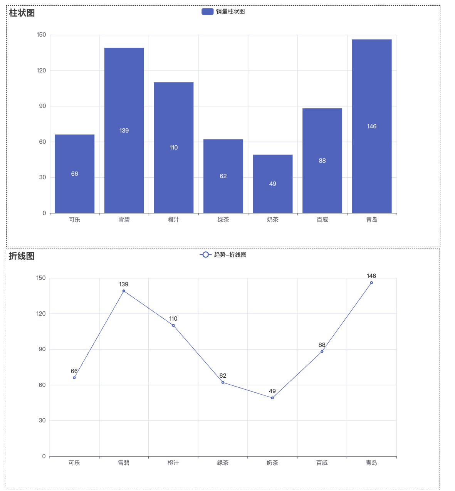

# pyecharts 教程

## 一、简介

## 二、基础

### 柱状图

```python
from pyecharts.charts import Bar
from pyecharts import options as opts
from pyecharts.globals import ThemeType

bar = (
    Bar(init_opts=opts.InitOpts(theme=ThemeType.LIGHT, bg_color="white"))
    .add_xaxis(xaxis_data=["A", "B", "C", "D"])
    .add_yaxis(
        series_name="销量",
        y_axis=[30, 60, 45, 80],
        itemstyle_opts=opts.ItemStyleOpts(color="green"),  # 设置柱子颜色为绿色
    )
    .set_global_opts(
        title_opts=opts.TitleOpts(
            title="柱状图示例",
            title_textstyle_opts=opts.TextStyleOpts(color="red")
        ),
        xaxis_opts=opts.AxisOpts(type_="category", name="X 轴"),
        yaxis_opts=opts.AxisOpts(type_="value", name="Y 轴"),  # Y轴应该是数值轴
        legend_opts=opts.LegendOpts(textstyle_opts=opts.TextStyleOpts(color="purple"))
    )
    .set_series_opts(
        label_opts=opts.LabelOpts(
            color="red",
            position="top"  # top bottom left right inside outside
        )
    )
)

# 渲染到Jupyter Notebook
bar.render_notebook()

```


### 折线图

```python
from pyecharts.charts import *
from pyecharts.globals import *
import pyecharts.options as opts

line = (
    Line(init_opts=opts.InitOpts(bg_color="white"))
    .add_xaxis(["Jan", "Feb", "Mar", "Apr"])
    .add_yaxis("销售额",[1000, 1200, 1100, 1300])
    .set_global_opts(title_opts=opts.TitleOpts(title="折线图示例"),toolbox_opts=opts.ToolboxOpts())
)

line.render_notebook()
```


### 饼图 Pie（环形 + 百分比）

```python
import pyecharts.options as opts 

pie = (
    Pie(init_opts=opts.InitOpts(
        bg_color="white",
        theme=ThemeType.LIGHT
    ))
    .add("产品占比",data_pair=[("手机", 40), ("平板", 30), ("电脑", 20), ("配件", 10)],radius=["40%","70%"])
    .set_series_opts(label_opts=opts.LabelOpts(formatter="{b}:{d}%"))
    .set_global_opts(title_opts=opts.TitleOpts(title="饼图示例"),toolbox_opts=opts.ToolboxOpts())
)

pie.render_notebook()
```


###  仪表盘 Gauge

```python
from pyecharts.charts import *
from pyecharts.globals import *
import pyecharts.options as opts 

gauge = (
    Gauge(init_opts=opts.InitOpts(
        theme=ThemeType.LIGHT,
        bg_color="white"
    ))
    .add("完成率",[("完成", 66)])
    .set_global_opts(title_opts=opts.TitleOpts(title="仪表板示例"),toolbox_opts=opts.ToolboxOpts())
)

gauge.render_notebook()
```


### 水球图 Liquid

```python
from pyecharts.charts import *
from pyecharts.globals import *
import pyecharts.options as opts 

liquid = (
    Liquid(init_opts=opts.InitOpts(
        theme=ThemeType.LIGHT,
        bg_color="white"
    ))
    .add("完成度",[0.45,0.3])
    .set_global_opts(title_opts=opts.TitleOpts(title="水球图示例"),
                     toolbox_opts=opts.ToolboxOpts())
)

liquid.render_notebook()
```


### 热力图 HeatMap

```python
from pyecharts.charts import HeatMap
from pyecharts import options as opts

x_data = ["Monday", "Tuesday", "Wednesday", "Thursday", "Friday", "Saturday", "Sunday"]
y_data = ["8AM", "10AM", "12PM", "2PM", "4PM", "6PM"]

# 构造 value，形如 [(x_index, y_index, value)]
import random
data = [[i, j, random.randint(0, 100)] for i in range(len(x_data)) for j in range(len(y_data))]

heatmap = (
    HeatMap(init_opts=opts.InitOpts(
        theme=ThemeType.LIGHT,
        bg_color="white"
    ))
    .add_xaxis(x_data)
    .add_yaxis("活跃度", y_data, data)
    .set_global_opts(
        title_opts=opts.TitleOpts(title="热力图示例"),
        visualmap_opts=opts.VisualMapOpts(min_=0, max_=100),
        toolbox_opts=opts.ToolboxOpts()
    )
)

heatmap.render_notebook()
```


### K线图 Kline

```python
from pyecharts.charts import Kline
from pyecharts import options as opts
from pyecharts.globals import *

# 示例数据（日期 & K线数据）
x_data = ["2025-07-01", "2025-07-02", "2025-07-03", "2025-07-04"]
y_data = [
    [2320.26, 2320.26, 2287.3, 2362.94],
    [2300, 2291.3, 2288.26, 2308.38],
    [2295.35, 2346.5, 2295.35, 2346.92],
    [2347.22, 2358.98, 2337.35, 2363.8]
]

kline = (
    Kline(init_opts=opts.InitOpts(
        theme=ThemeType.LIGHT,
        bg_color="white"
    ))
    .add_xaxis(x_data)
    .add_yaxis("K线图", y_data)
    .set_global_opts(
        title_opts=opts.TitleOpts(title="K线图示例"),
        xaxis_opts=opts.AxisOpts(type_="category"),
        yaxis_opts=opts.AxisOpts(type_="value"),
        datazoom_opts=[opts.DataZoomOpts(), opts.DataZoomOpts(type_="inside")],
        tooltip_opts=opts.TooltipOpts(trigger="axis", axis_pointer_type="cross"),
        toolbox_opts=opts.ToolboxOpts()
    )
)

kline.render_notebook()
```


### 漏斗图 Funnel

```python
from pyecharts.charts import Funnel
from pyecharts.globals import *
import pyecharts.options as opts 

funnel = (
    Funnel(init_opts=opts.InitOpts(
        theme=ThemeType.LIGHT,
        bg_color="white"
    ))
    .add("转化", [("展示", 100), ("点击", 80), ("咨询", 50), ("购买", 30)])
    .set_global_opts(title_opts=opts.TitleOpts(title="漏斗图示例"),
                     toolbox_opts=opts.ToolboxOpts())
)
funnel.render_notebook()
```


### 散点图

```python
from pyecharts.charts import *
from pyecharts.globals import *
import pyecharts.options as opts 
import random

x_data = [i for i in range(50)]
y_data = [random.randint(0, 100) for _ in range(50)]

scatter = (
    Scatter(init_opts=opts.InitOpts(
        theme=ThemeType.LIGHT,
        bg_color="white"
    ))
    .add_xaxis(x_data)
    .add_yaxis("",y_axis=y_data)
    .set_global_opts(title_opts=opts.TitleOpts(title="基础散点图"),
                     xaxis_opts=opts.AxisOpts(type_="value"),
                     yaxis_opts=opts.AxisOpts(type_="value"),
                     toolbox_opts=opts.ToolboxOpts())
)

scatter.render_notebook()
```


## 三、实战

### 1. 柱状图

```python
from pyecharts.charts import Bar
from pyecharts import options as opts 
from pyecharts.faker import Faker
from pyecharts.globals import ThemeType

bar = Bar(init_opts=opts.InitOpts(
    theme=ThemeType.LIGHT,
    width='1000px',
    height='600px'
))

bar.add_xaxis(Faker.choose()) 

# stack值一样的系列会堆叠在一起 所以 A 和 B 堆叠在一起
bar.add_yaxis('A',Faker.values(),stack="stack1")
bar.add_yaxis('B',Faker.values(),stack='stack1')
bar.add_yaxis('C',Faker.values(),stack="stack2")

bar.set_global_opts(toolbox_opts=opts.ToolboxOpts(is_show=True))
bar.render_notebook()
```


```python
from pyecharts import options as opts 
from pyecharts.charts import Bar
from pyecharts.faker import Faker
from pyecharts.globals import ThemeType

bar = Bar(init_opts=opts.InitOpts(
    theme=ThemeType.LIGHT,
))

bar.add_xaxis(Faker.choose())
bar.add_yaxis('',Faker.values())
bar.set_series_opts(label_opts=opts.LabelOpts(
    position='insideLeft',
    formatter="{b}:{c}"
))
# 隐藏坐标系
bar.set_global_opts(xaxis_opts=opts.AxisOpts(is_show=False),
                    yaxis_opts=opts.AxisOpts(is_show=False),
                    toolbox_opts=opts.ToolboxOpts(is_show=True)
                    )
bar.reversal_axis() # 反转坐标系
bar.render_notebook()
```


##### 自定义坐标轴标签文本

**pyecharts 常见 formatter 占位符速查表**

| 占位符 | 含义 | 适用位置 | 示例显示 |
|--------|------|----------|-----------|
| `{a}`  | 系列名（series name）         | 图例、提示框               | 销量 |
| `{b}`  | 类目名（x轴分类名）           | 标签、提示框               | 北京 / 2010 |
| `{c}`  | 数据值（value）               | 标签、提示框               | 30 |
| `{d}`  | 饼图中的百分比                | 饼图、提示框               | 45% |
| `{value}` | 坐标轴刻度值              | `axislabel_opts.formatter` | 2020年 |
| `{@[系列名]}` | 特定系列的数据值       | 多系列提示框               | `@销量` |
| `{@[维度名]}` | 多维数据中特定维度值   | 提示框                     | `@日期` |


```python
from pyecharts.charts import Bar
from pyecharts import options as opts 
from pyecharts.globals import ThemeType
import random

x_data = list(range(2010,2020))
y_data = [random.randint(20,200) for _ in range(len(x_data))]

bar = Bar(init_opts=opts.InitOpts(
    theme=ThemeType.LIGHT
))

bar.add_xaxis(x_data)
bar.add_yaxis('',y_data)

bar.set_global_opts(xaxis_opts=opts.AxisOpts(
    axislabel_opts=opts.LabelOpts(
        formatter='{value}年'
    )
),toolbox_opts=opts.ToolboxOpts(is_show=True))

bar.render_notebook()
```


#### 2. 散点图

```python
from pyecharts.charts import Scatter
from pyecharts import options as opts 
from pyecharts.globals import ThemeType
import random 

x_data = [random.randint(0,20) for _ in range(100)]
y_data = [random.randint(0,50) for _ in range(100)]

scatter = Scatter(init_opts=opts.InitOpts(
    theme=ThemeType.LIGHT,
    bg_color='white'
))
scatter.add_xaxis(x_data)
scatter.add_yaxis('',y_data)
# X轴默认数据类型为离散数据，设置为数值型
scatter.set_global_opts(xaxis_opts=opts.AxisOpts(type_='value',name="X 轴"),
                        toolbox_opts=opts.ToolboxOpts(is_show=True))

scatter.render_notebook()
```


##### 为什么需要 `type_="value"`？

在 Pyecharts 中，X 轴或 Y 轴的 `type_` 决定了坐标轴的表现方式。默认是 `"category"`（类目轴），如果使用了数值型数据，则需要显式设置为 `"value"`，否则会当作分类处理，导致图表显示异常。

| 取值         | 含义           | 适用场景说明                                                                 |
|--------------|----------------|------------------------------------------------------------------------------|
| `"value"`    | 数值轴         | 坐标轴用于连续的数值数据，比如散点图、折线图中的坐标值                     |
| `"category"` | 类目轴（默认） | 坐标轴用于表示分类，如 ["A", "B", "C"]，常用于柱状图、饼图等                |
| `"time"`     | 时间轴         | 专门用于时间序列数据，如 ["2021-01", "2021-02"]                             |
| `"log"`      | 对数轴         | 数据跨度很大时使用，例如金融或科学实验中经常使用                           |


#### 3.双Y轴【直方图&折线图】

```python
from pyecharts.charts import Bar,Line
from pyecharts import options as opts 
from pyecharts.globals import ThemeType
import random

x_data = ['香蕉', '梨子', '水蜜桃', '核桃', '西瓜', '苹果']
y_data_1 = [random.randint(10, 50) for _ in range(len(x_data))]
y_data_2 = [random.randint(100, 500) for _ in range(len(x_data))]

bar = Bar(init_opts=opts.InitOpts(
    theme=ThemeType.LIGHT,
    bg_color='white'
))

bar.add_xaxis(x_data)
# 添加一个新的坐标轴
bar.extend_axis(yaxis=opts.AxisOpts()) 
# yaxis_index 指定该系列使用第几个 y 轴（0 表示第一个）
bar.add_yaxis('左边 Y 轴',y_data_1,yaxis_index=0)

line = Line(init_opts=opts.InitOpts(
    theme=ThemeType.LIGHT,
    bg_color='white'
))
line.add_xaxis(x_data)
line.add_yaxis('右边 Y 轴',y_data_2,yaxis_index=1)
line.set_series_opts(z=5)  # 设置折线图在上层 默认 z 为 0，值越大，图层越靠上。

bar.overlap(line)

bar.set_global_opts(toolbox_opts=opts.ToolboxOpts(
    is_show=True
))

bar.render_notebook()
```


#### 4. 双 X 轴

```python
from pyecharts.charts import Line
from pyecharts import options as opts 
from pyecharts.globals import ThemeType
import random


x_data_1 = ["2020/10/{}".format(i + 1) for i in range(30)]
x_data_2 = ["2019/10/{}".format(i + 1) for i in range(30)]
y_data_1 = [random.randint(10, 50) for _ in range(30)]
y_data_2 = [random.randint(20, 60) for _ in range(30)]

line = Line(init_opts=opts.InitOpts(
    theme=ThemeType.LIGHT,
    bg_color='white'
))

line.add_xaxis(x_data_1)
# 添加一个x轴
line.extend_axis(xaxis=opts.AxisOpts(),xaxis_data=x_data_2)

line.add_yaxis('下面X 轴',y_data_1)
line.add_yaxis('上面 X 轴',y_data_2)

line.set_global_opts(toolbox_opts=opts.ToolboxOpts(is_show=True))

line.render_notebook()
```


#### 5. 自定义图例


### 2. 组合图 Grid

```python
from pyecharts.charts import *
from pyecharts import options as opts 
from pyecharts.globals import *
from pyecharts.faker import Faker

x_data = Faker.choose()
y_data = Faker.values()

bar = (
    Bar()
    .add_xaxis(xaxis_data=x_data)
    .add_yaxis(series_name="水果柱状图",y_axis=y_data)
    .set_global_opts(title_opts=opts.TitleOpts(title="柱状图",pos_bottom="45%"),legend_opts=opts.LegendOpts(
        pos_bottom="45%"
    ),toolbox_opts=opts.ToolboxOpts(is_show=True))
)

line = (
    Line()
    .add_xaxis(xaxis_data=x_data)
    .add_yaxis(series_name="水果折线图",y_axis=y_data)
    .set_global_opts(title_opts=opts.TitleOpts(title="折线图",pos_bottom="95%"))
)

grid = (
    Grid(init_opts=opts.InitOpts(theme=ThemeType.LIGHT,bg_color="white"))
    .add(bar,grid_opts=opts.GridOpts(pos_top="60%"))
    .add(line,grid_opts=opts.GridOpts(pos_bottom="60%"))
    
)
grid.render_notebook()
```


### 3. 图表标签页（Tabs）

```python
from pyecharts.charts import Bar, Line, Tab
from pyecharts import options as opts
from pyecharts.faker import Faker

# 创建柱状图
bar = (
    Bar()
    .add_xaxis(Faker.choose())
    .add_yaxis("销售额", Faker.values())
    .set_global_opts(title_opts=opts.TitleOpts(title="柱状图"))
)

# 创建折线图
line = (
    Line()
    .add_xaxis(Faker.choose())
    .add_yaxis("趋势", Faker.values())
    .set_global_opts(title_opts=opts.TitleOpts(title="折线图"))
)

# 添加到 Tab
tab = Tab()
tab.add(bar, "柱状图")
tab.add(line, "折线图")

# 渲染到 notebook 或 HTML 文件
tab.render_notebook()
# tab.render("tab_example.html")
```


### 4.组合图 Page

```python
from pyecharts.charts import *
from pyecharts import options as opts 
from pyecharts.globals import *
from pyecharts.faker import *

x_data = Faker.choose()
y_data = Faker.values()

bar = (
    Bar(init_opts=opts.InitOpts(bg_color="white"))
    .add_xaxis(x_data)
    .add_yaxis("销量柱状图",y_data)
    .set_global_opts(title_opts=opts.TitleOpts(title="柱状图"))
)

line = (
    Line(init_opts=opts.InitOpts(bg_color="white"))
    .add_xaxis(x_data)
    .add_yaxis("趋势-折线图",y_data)
    .set_global_opts(title_opts=opts.TitleOpts(title="折线图"))
)

page = (
    Page(layout=Page.SimplePageLayout)
    .add(bar,line)
)

page.render_notebook()
```



### 5. Timeline 时间轴

```python
from pyecharts.charts import *
from pyecharts import options as opts 
from pyecharts.globals import *

# 多个年份的示例数据
years = ["2020", "2021", "2022"]
data = {
    "2020": [5, 20, 36, 10, 75, 90],
    "2021": [15, 25, 40, 20, 65, 80],
    "2022": [25, 30, 50, 40, 60, 70]
}

x = ["苹果", "香蕉", "橘子", "芒果", "梨", "葡萄"]

timeline = Timeline(init_opts=opts.InitOpts(
    theme=ThemeType.LIGHT,
    bg_color="white"
))

for year in years:
    bar = (
        Bar()
        .add_xaxis(x)
        .add_yaxis("水果销量",data[year])
        .set_global_opts(title_opts=opts.TitleOpts(
            title=f'{year}年销量'
        ))
    )

    timeline.add(bar,time_point=year)

timeline.add_schema(
    play_interval=2000, # 播放间隔，单位是毫秒
    is_auto_play=False,
    is_loop_play=True,
    pos_bottom="0%"
)

timeline.render_notebook()
```


## 四、项目实战

### 1. 连续型时间数据可视化

#### 阶梯图

```python
import matplotlib.pyplot as plt 

# 设置中文字体，防止乱码
plt.rcParams["font.sans-serif"] = ["STHeiTi"]
# 设置正常显示负号
plt.rcParams["axes.unicode_minus"]=False

# 要展示的数据点
x = [1, 2, 2.5, 4.5]
y = [0.5, 1, 2, 3]

plt.step(x=x,y=y,where="mid") # 阶梯在 两个点之间的中点改变
plt.xlabel('时间轴')
plt.ylabel('数值轴')

plt.show()
```


#### 玫瑰图

```python
import pandas as pd
from pyecharts.charts import Pie
from pyecharts import options as opts

# 准备数据
provinces = ['北京','上海','黑龙江','吉林','辽宁','内蒙古','新疆','西藏','青海','四川','云南','陕西','重庆',
             '贵州','广西','海南','澳门','湖南','江西','福建','安徽','浙江','江苏','宁夏','山西','河北','天津']
num = [1,1,1,17,9,22,23,42,35,7,20,21,16,24,16,21,37,12,13,14,13,7,22,8,16,13,13]
color_series = ['#FAE927','#E9E416','#C9DA36','#9ECB3C','#6DBC49',
                '#37B44E','#3DBA78','#14ADCF','#209AC9','#1E91CA',
                '#2C6BA0','#2B55A1','#2D3D8E','#44388E','#6A368B'
                '#7D3990','#A63F98','#C31C88','#D52178','#D5225B',
                '#D02C2A','#D44C2D','#F57A34','#FA8F2F','#D99D21',
                '#CF7B25','#CF7B25','#CF7B25']
             
 # 创建数据框
df = pd.DataFrame({'provinces': provinces, 'num': num})
# 降序排序
df.sort_values(by='num', ascending=False, inplace=True)

# 提取数据
v = df['provinces'].values.tolist()
d = df['num'].values.tolist()

# 实例化Pie类
pie1 = Pie(init_opts=opts.InitOpts(width='1350px', height='750px'))
# 设置颜色
pie1.set_colors(color_series)
# 添加数据，设置饼图的半径，是否展示成南丁格尔图
pie1.add("", [list(z) for z in zip(v, d)],
        radius=["30%", "135%"],
        center=["50%", "65%"],
        rosetype="area"
        )
# 设置全局配置项
pie1.set_global_opts(title_opts=opts.TitleOpts(title='玫瑰图示例'),
                     legend_opts=opts.LegendOpts(is_show=False),
                     toolbox_opts=opts.ToolboxOpts())
# 设置系列配置项
pie1.set_series_opts(label_opts=opts.LabelOpts(is_show=True, position="inside", font_size=12,
                                               formatter="{b}:{c}天", font_style="italic",
                                               font_weight="bold", font_family="Microsoft YaHei"
                                               ),
                     )
# 生成html文档
pie1.render_notebook()
```


