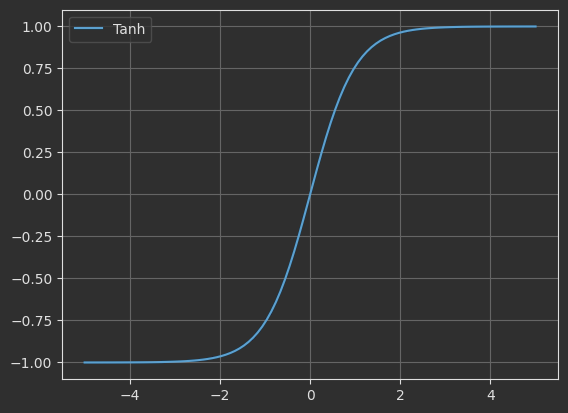
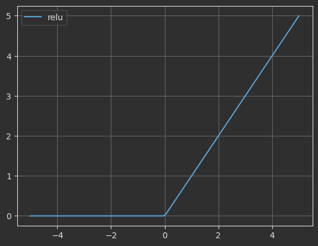
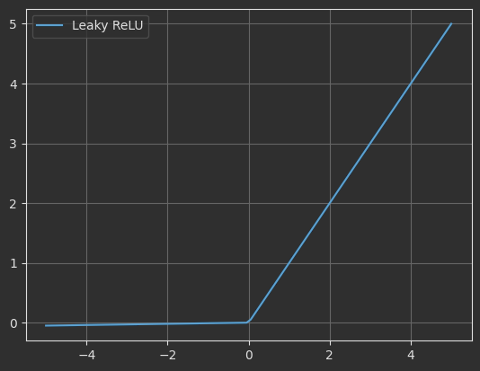
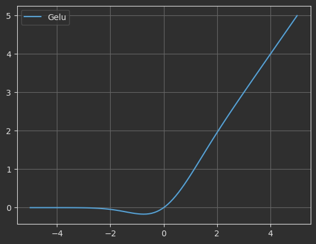

# 激活函数

激活函数（Activation Function）是深度学习中非线性变换的核心机制，用于控制神经网络中每个神经元的输出。

## 一、Sigmoid

Sigmoid函数是神经网络中常用的激活函数之一，尤其在二分类问题的输出层中广泛应用。下面我将从多个方面详细介绍Sigmoid函数。

Sigmoid函数（又称Logistic函数）是一种S型曲线函数，它将任意实数输入映射到(0,1)区间。在神经网络中，它曾经是最常用的激活函数之一，特别适合需要输出概率的场景。


### 1.1  数学定义

Sigmoid函数的数学表达式为：$f(x) = \frac{1}{1 + e^{-x}}$ 

!!! info
    
    + e是自然对数的底数(约2.71828)
    + x是函数的输入值


### 1.2 优缺点

**优点：**

+ **概率解释**：输出值在0-1之间，天然适合表示概率
+ **平滑性**：处处可导，便于梯度下降优化
+ **单调性**：保证误差曲面不会出现局部极小值
+ **历史地位**：早期神经网络的基础激活函数

**缺点：**

+ **梯度消失**：当|x|较大时梯度接近0，导致深层网络训练困难
+ **非零中心**：输出全为正数，影响梯度更新效率
+ **计算成本**：包含指数运算，计算量较大
+ **敏感区间窄**：仅在输入接近0时敏感，两端饱和

### 1.3 实现代码

```python
import torch
import torch.nn.functional as F
import matplotlib.pyplot as plt

x = torch.linspace(-5,5,100)

y = F.sigmoid(x)

plt.plot(x.numpy(),y.numpy(),label="sigmoid")
# plt.grid(True)
plt.legend()
plt.show()
```


## 二、Tanh

Tanh（Hyperbolic Tangent，双曲正切）函数是一种S型曲线激活函数，它将任意实数输入映射到(-1,1)区间。Tanh可以看作Sigmoid函数的缩放平移版本，在神经网络中常用于隐藏层。



### 2.1 数学公式

$$
f(x) = \tanh(x)
$$

### 2.2 优缺点

**优点：**

+ 零中心化：输出均值为0，使下一层学习更高效
+ 梯度更强：相比Sigmoid，梯度更大（最大梯度为1）
+ 平滑性：处处可导，便于梯度下降优化
+ 单调性：保证误差曲面不会出现局部极小值

**缺点：**

+ 梯度消失：当|x|较大时梯度接近0，导致深层网络训练困难
+ 计算成本：包含指数运算，计算量较大
+ 敏感区间窄：仅在输入接近0时敏感，两端饱和

### 2.3 代码实现

```python
import torch
import torch.nn.functional as F
import matplotlib.pyplot as plt

x = torch.linspace(-5,5,100)

y = F.tanh(x)

plt.plot(x.numpy(),y.numpy(),label="Tanh")
plt.grid(True)
plt.legend()
plt.show()
```

## 三、ReLU

ReLU（修正线性单元）是目前深度学习中最常用的激活函数，定义为：$f(x) = max(0, x)$ 即对于输入x，当x>0时输出x，否则输出0。



### 3.1 数学公式

$$
f(x) = \max(0, x)
$$

### 3.2 优缺点

**优点：**

1. 计算高效：
    + 只需简单的max操作，计算速度远快于Sigmoid/Tanh的指数运算
    + 在大型网络和深层架构中优势明显
2. 缓解梯度消失：
    + 正区间的梯度恒为1，有效解决深层网络的梯度消失问题
    + 使网络可以训练得更深（如ResNet超过100层）
3. 稀疏激活：
    + 负输入完全被抑制，产生真正的零激活
    + 模拟生物神经元的"全有或全无"特性
    + 自动实现特征选择，提高模型泛化能力
4. 收敛速度快：
    + 相比Sigmoid/Tanh，ReLU能使网络更快收敛
    + 实验表明通常快6倍左右

**缺点：**

1. 神经元死亡问题（Dying ReLU）：
    + 当输入始终为负时，梯度恒为0，神经元永久失效
    + 学习率设置过高时尤其明显
2. 非零中心性：
    + 输出始终≥0，不是以0为中心
    + 可能影响梯度下降效率
3. 无负值输出：
    + 完全抑制负值信息，可能丢失重要特征
4. 无界输出：
    + 正区间理论上无上限
    + 可能导致某些情况下激活值过大

### 3.3 代码实现

```python
import torch
import torch.nn.functional as F
import matplotlib.pyplot as plt

x = torch.linspace(-5,5,100)

y = F.relu(x)

plt.plot(x.numpy(),y.numpy(),label="relu")
plt.grid(True)
plt.legend()
plt.show()
```

## 四、Leaky ReLU

Leaky ReLU是ReLU激活函数的改进版本，旨在解决"神经元死亡"问题。




### 4.1 数学公式

$$
f(x) = \begin{cases} x, & x>0 \\ \alpha x, & x \le 0 \end{cases}
(-∞, ∞)
$$


### 4.2 核心特点

+ **负区间斜率**：保留负值区域的小斜率（α），而不是完全置零
+ **参数设置**：α通常设为0.01，也可作为可学习参数（此时称为PReLU）
+ **计算效率**：依然保持较高的计算效率，只比标准ReLU稍复杂

### 4.3 优缺点

**优点：**

1. **解决神经元死亡问题**：
      + 负区间仍有微小梯度（α），使神经元有机会恢复
      + 实验显示可减少约30%的"死亡神经元"
2. **保留ReLU优势**：
      + 正区间保持线性特性，避免梯度消失
      + 计算仍然高效，适合深层网络
3. **稀疏激活保留**：
      + 虽然负值不完全归零，但仍保持高度稀疏性
      + 维持了ReLU的特征选择能力
4. **实践表现优异**：
      + 在图像分类等任务中常优于标准ReLU
      + 特别适合噪声较多的数据集

**缺点：**

1. 效果依赖超参数：
      + α值需要谨慎选择（太小无效，太大会丧失ReLU特性）
      + 常用α=0.01，但并非所有场景最优
2. 理论保证不足：
      + 不像SELU有数学上的归一化证明
      + 性能提升缺乏严格理论支持
3. 非零中心问题：
      + 输出均值仍不为零，影响梯度更新效率
      + 此问题在ELU/SELU中得到更好解决
4.计算稍复杂：
      + 比标准ReLU多一次乘法运算
      + 在极低功耗设备上可能影响效率

### 4.4 代码实现

```python
import torch
import torch.nn.functional as F
import matplotlib.pyplot as plt

x = torch.linspace(-5,5,100)

y = F.leaky_relu(x)

plt.plot(x.numpy(),y.numpy(),label="Leaky ReLU")
plt.grid(True)
plt.legend()
plt.show()
```

## 五、GELU

GELU（高斯误差线性单元）是一种近年来提出的高性能激活函数，被广泛应用于Transformer架构（如BERT、GPT等）。它将神经元的非线性与随机正则化思想相结合，通过高斯分布的累积分布函数对输入进行变换。



### 5.1 数学公式

$$
GELU(x) = xΦ(x) = x·1/2[1 + erf(x/√2)]
$$

!!! info
   
    + Φ(x)是标准高斯分布的累积分布函数

    + erf是误差函数：$erf(x) = 2/√π ∫₀ˣ e⁻ᵗ² dt$


### 5.2 核心特点

+ **概率视角**：将输入乘以其"被保留的概率"Φ(x)
+ **平滑过渡**：相比ReLU的硬边界，提供平滑的非线性过渡
+ **自适应性**：根据输入幅度自动调整激活强度
+ **双向激活**：同时处理正负输入（不同于ReLU的单向激活）

### 5.3 优缺点

**优点：**

1. 卓越的模型性能：
    + 在自然语言处理任务中表现显著优于ReLU
    + 在BERT、GPT等SOTA模型中成为标准配置
2. 数学理论基础强：
    + 基于随机正则化的概率解释（Dropout的确定性版本）
    + 与神经网络的随机正则化有理论联系
3. 平滑梯度流：
    + 处处可导，没有ReLU的硬截断
    + 缓解梯度消失/爆炸问题
4. 自适应非线性：
    + 自动平衡线性和非线性行为
    + 大输入时接近线性，小输入时表现强非线性
5. 零中心性：
    + 输出均值为零，有利于网络训练动态平衡

**缺点：**

1. 计算复杂度高：
    + 涉及特殊函数（erf）计算
    + 比ReLU计算成本高约3-5倍
2. 实现不一致性：
    + 不同框架使用不同近似公式
    + 可能导致跨平台结果差异
3. 小数据集过拟合：
    + 在小型数据集上可能表现不如ReLU
    + 需要足够数据量才能体现优势
4. 理论理解门槛高：
    + 概率解释较抽象，不如ReLU直观
    + 超参数调节缺乏明确指导

### 5.4 代码实现

```python
import torch
import torch.nn.functional as F
import matplotlib.pyplot as plt

x = torch.linspace(-5,5,100)

y = F.gelu(x)

plt.plot(x.numpy(),y.numpy(),label="Gelu")
plt.grid(True)
plt.legend()
plt.show()

```

