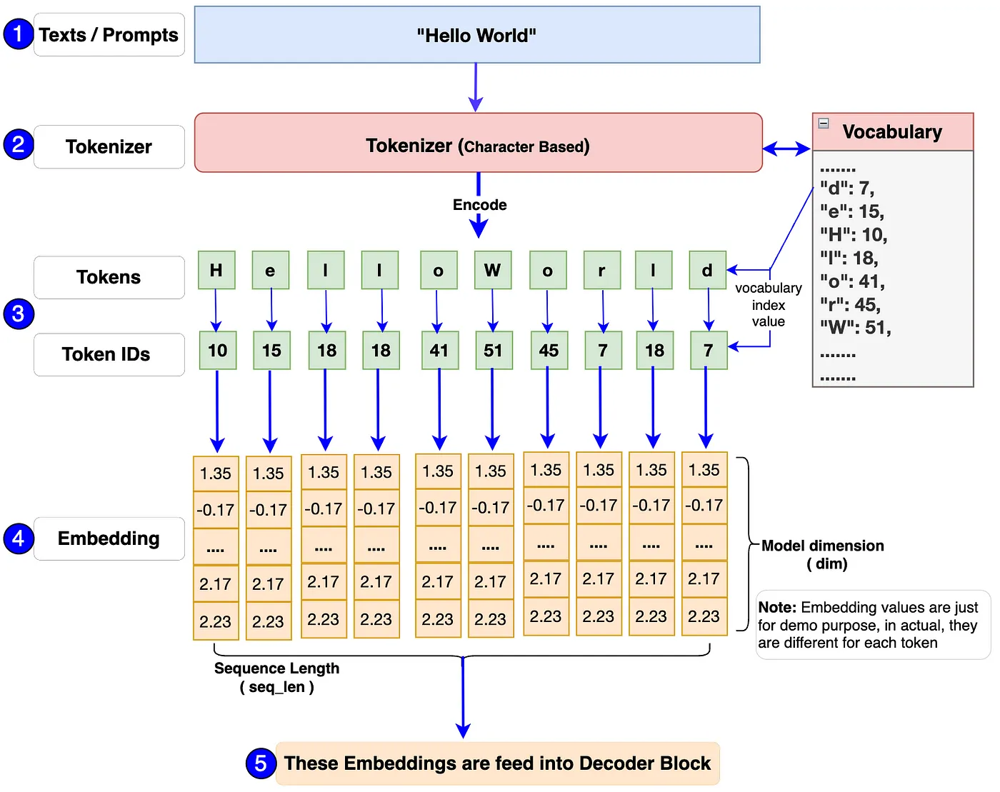
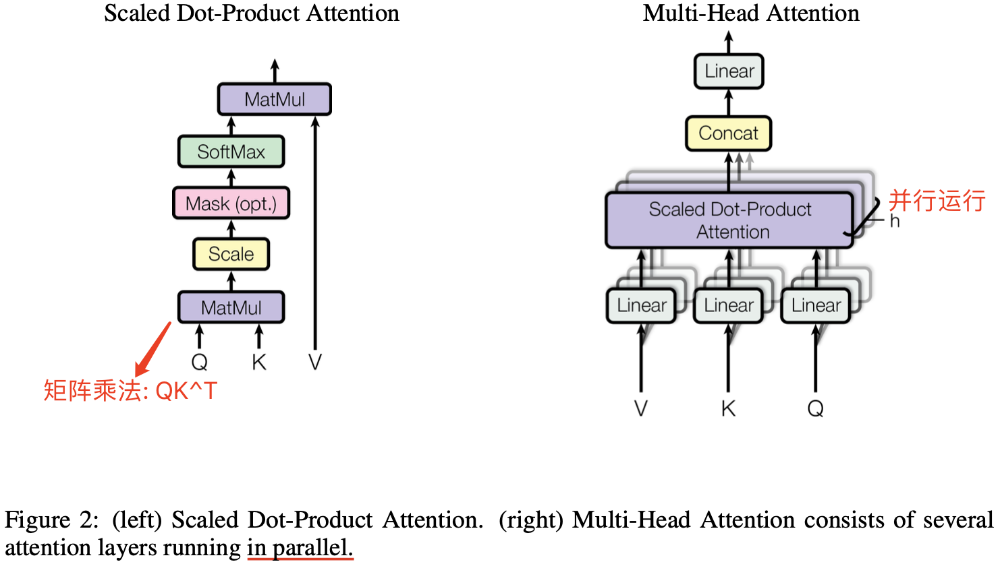
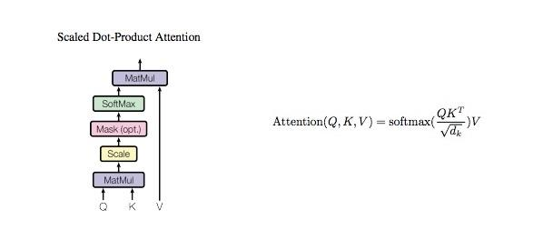

# Transformer

## 基础概念

[Transformer论文详解](https://github.com/buffaloboyhlh/AI-Guide-and-Demos-zh_CN/blob/master/PaperNotes/Transformer%20%E8%AE%BA%E6%96%87%E7%B2%BE%E8%AF%BB.md)

## 动手实现Transformer

[动手实现transformer](https://zhuanlan.zhihu.com/p/622517860)


### 一、输入模块

#### 1.1 tokenizer 预处理

Transformer 架构的 LLM 的输入通常都是字符串文本，而模型是不能直接处理字符串文本数据，需要通过 tokenizer 完成预处理工作，即 tokenized 分词、词元编码以及最后的转成 input ids 向量（矩阵）过程。

**id 数值对应的是 tokenizer 词汇表中的索引，也叫 token id**。一句话总结就是，tokenizer 的作用就是将这些文本/提示词转换为 token-id（词汇表中 token 的索引）。

这里以 Hugging Face 的 transformers 库为例，展示如何将输入文本处理为 Transformer 模型能够理解的 input ids 形式。

```python
from transformers import BertTokenizer

model_name = "bert-base-uncased"
# 1. 加载 bert 的 tokenizer 模型
tokenizer = BertTokenizer.from_pretrained(model_name)

# 2. 输入文本
input_text = "this is a boy who can fly"

# 3. 将文本分词并且映射成ID序列，会自动加入特殊符号 [CLS] 和 [SEP]
input = tokenizer(input_text, add_special_tokens=False)  #add_special_tokens 不添加 [CLS] 和 [SEP]
print("映射的ID序列：", input["input_ids"])


tokens = []
for key in input_text.split():
    tokens.append(f"{key}:{tokenizer.get_vocab()[key]}")
print("单词在词表中对应的序列：", tokens)
```
!!! note
    原始输入文本 "this is a boy who can fly" , 通过 tokenizer 完成分词和词表映射工作，生成的输入 ID 列表：[2023, 2003, 1037, 2879, 2040, 2064, 4875]


#### 1.2 Embedding 层

Embedding 层 ，中文叫嵌入层，作用是将离散的正整数序列（ input ids）映射到固定尺寸的连续稠密向量（embedding vectors）。虽然最常用的 emdedding 是单词 embedding，但是实际上万物皆可 embedding（嵌入），如图片、语音等 embedding。

LLM 中，单词 token 需要经过 Embedding 层，Embedding 层的作用是将输入的离散化表示（例如 token ids）转换为连续的低维向量表示，其由单词 Embedding 和位置 Embedding （Positional Encoding）相加得到，通常定义为 TransformerEmbedding 层。

##### 1.2.1 单词 Embedding

自然语言处理中的词汇通常是离散的符号，是无法直接输入到神经网络中，而词嵌入层（Token Embedding 层）通过学习一个嵌入矩阵，将每个词汇的唯一标识（通常是索引）映射到一个固定维度的连续向量。

传统的词嵌入方法（如 Word2Vec、Glove）生成的嵌入是静态的，即每个词汇对应一个固定的向量。而 现代LLM（如 BERT、GPT）采用的是上下文感知的嵌入，即同一个词在不同上下文中可以有不同的向量表示，这是通过使用更复杂的模型架构（如 Transformer）实现的，嵌入层与模型的其他部分协同工作，动态生成词汇的向量表示。

假设输入 token 序列的维度是 [batch_size, seq_len, vocab_size]（后续都统一把输入维度写前，输出维度写后），经过词嵌入层后的输出维度是 [batch_size, seq_len, d_model]。对应的词嵌入层权重矩阵的大小为：[vocab_size, d_model]，即词嵌入层的参数量为：

词 Embedding 层通常使用 nn.Embedding 实现。nn.Embedding 的输入输出形式: - 输入：一个整数张量，表示词表索引（即每个 token 在词表中的位置）。输入形状: (batch_size, sequence_length)，其中 batch_size 表示批次中的样本数，sequence_length 表示每个输入序列的长度。 - 输出：每个词对应的嵌入向量，维度是可配置的（比如 100 维或 300 维）。输出的形状:(batch_size, sequence_length, embedding_dim)。


```python
import torch
from transformers import BertTokenizer
import torch.nn as nn

model_name = "bert-base-uncased"
# 1. 加载 bert 的 tokenizer 模型
tokenizer = BertTokenizer.from_pretrained(model_name)

batch_text = ["he is a good man", "she is super girl", "Tom is a cat"]

tokens = tokenizer(batch_text, return_tensors="pt", truncation=True, padding=True)

token_ids = tokens["input_ids"]  # 单词对应的ID序列
print("token_ids shape: ", token_ids.shape)  # shape=(batch_size,seq_length)

# 创建一个 nn.Embedding层
vocab_size = tokenizer.vocab_size  # 词表大小
embedding_dim = 256  # 嵌入向量的维度
embedding_layer = nn.Embedding(vocab_size, embedding_dim)

# 通过 nn.Embedding 层，将输入的 IDs 映射到嵌入向量
output = embedding_layer(token_ids)
print("output shape: ", output.shape)  # shape = (batch_size, sequence_length, embedding_dim)

# 下面以一个单词为例，演示整个过程

key = "girl"
key_id = tokenizer.convert_tokens_to_ids(key) # 获取单词girl对应的token id
key_embedding = embedding_layer(torch.tensor(key_id))
print(f"key={key}  token_id={key_id}  key_embedding={key_embedding}")

# 对比output中的key对应的嵌入向量 
print(output[1,4]==key_embedding) # 输出结构为 true 矩阵
```

##### 1.2.2 位置 Embedding

Transformer 中除了单词的 Embedding，还需要使用位置 Embedding 表示单词出现在句子中的位置。因为 Transformer 不采用 RNN 的结构，而是使用全局信息，不能利用单词的顺序信息，而这部分信息对于 NLP 来说非常重要。所以 Transformer 中需要使用位置 Embedding 保存单词在序列中的相对或绝对位置。

位置 Embedding 用 PE 表示，PE 的维度与单词 Embedding 是一样的。PE 可以通过训练得到，也可以使用某种公式计算得到。在 Transformer 中采用了后者，计算公式如下：

$$
\begin{aligned}
PE_{(pos, 2i)} &= \sin\left(\frac{pos}{10000^{2i/d_{\text{model}}}}\right), 
\\ PE_{(pos, 2i+1)} &= \cos\left(\frac{pos}{10000^{2i/d_{\text{model}}}}\right).
\end{aligned}
$$
其中：

- $pos$ 表示位置索引（Position）。
- $i$ 表示维度索引。
- $d_{\text{model}}$ 是嵌入向量的维度。

```python
import torch.nn as nn
import torch
import math

class PostionalEmbedding(nn.Module):
    def __init__(self, d_model,dropout=0.1,max_len=5000):
        """
        位置编码，为输入序列中的每个位置添加唯一的位置表示，以引入位置信息。

        参数:
            d_model: 嵌入维度，即每个位置的编码向量的维度。
            dropout: 位置编码后应用的 Dropout 概率。
            max_len: 位置编码的最大长度，适应不同长度的输入序列。
        """
        super(PostionalEmbedding, self).__init__()

        self.dropout = nn.Dropout(dropout)

        # 创建位置编码矩阵，形状为 (max_len, d_model)
        pe = torch.zeros(max_len,d_model)
        position = torch.arange(0, max_len, dtype=torch.float).unsqueeze(1) # 位置索引 (max_len, 1)

        # 计算每个维度对应的频率
        div_term = torch.exp(
            (torch.arange(0, d_model, 2)/ d_model) * (-math.log(10000.0))
        )

         # 将位置和频率结合，计算 sin 和 cos
        pe[:, 0::2] = torch.sin(position * div_term)  # 偶数维度
        pe[:, 1::2] = torch.cos(position * div_term)  # 奇数维度

        # 增加一个维度，方便后续与输入相加，形状变为 (1, max_len, d_model)
        pe = pe.unsqueeze(0)
        # 将位置编码注册为模型的缓冲区，不作为参数更新
        self.register_buffer('pe', pe)

    def forward(self,x):
        """
        前向传播函数。

        参数:
            x: 输入序列的嵌入向量，形状为 (batch_size, seq_len, d_model)。

        返回:
            加入位置编码和 Dropout 后的嵌入向量，形状为 (batch_size, seq_len, d_model)。
        """
        # 取出与输入序列长度相同的部分位置编码，并与输入相加
        x = x + self.pe[:, :x.size(1), :]
        # 应用 dropout
        return self.dropout(x)

```

##### 1.2.3 TransformerEmbedding 层实现

总结：transformer 输入模块有三个组成部分：文本/提示词、分词器（Tokenizer）和嵌入层（Embeddings）。输入模块的工作流程和代码实现如下所示:



矩阵的每一列表示一个 token 的嵌入向量。


### 二、Multi-Head Attention 结构

Encoder 和 Decoder 结构中公共的 layer 之一是 Multi-Head Attention，其是由多个 Self-Attention 并行组成的。Encoder block 只包含一个 Multi-Head Attention，而 Decoder block 包含两个 Multi-Head Attention (其中有一个用到 Masked)。



#### 2.1 Self-Attention 结构

Self-Attention 中文翻译为自注意力机制，论文中叫作 Scale Dot Product Attention，它是 Transformer 架构的核心，其结构如下图所示：




#### 2.2 Self-Attention 实现


