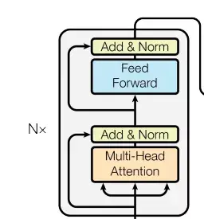
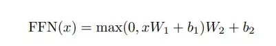
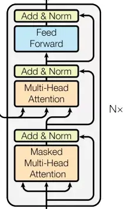
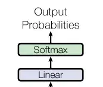
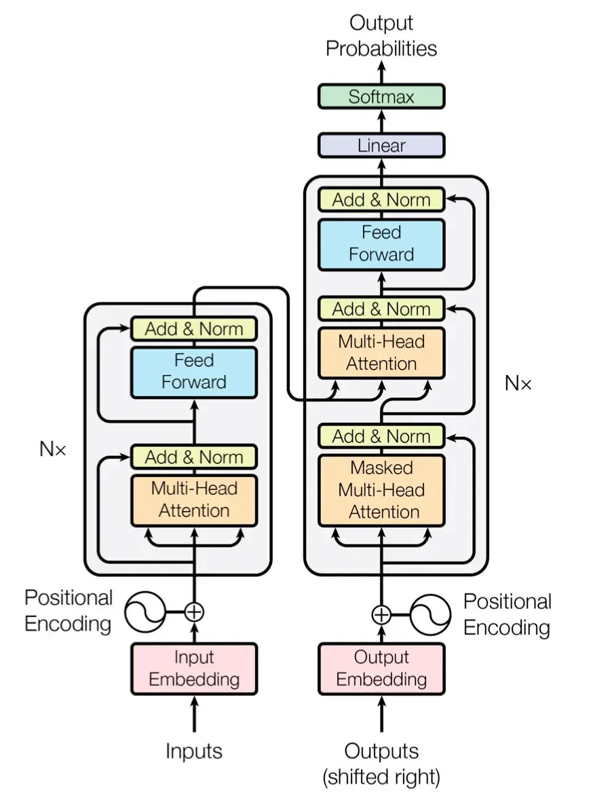

# Transformer模型架构

## 参考文章

[Transformer架构基础概念](https://ifwind.github.io/2021/08/31/Transformer-BERT-%E5%AE%9E%E6%88%98/)

## Transformer 实现代码

### 一、模型输入

#### 1.1  Embedding（词嵌入）

Embedding层的作用是将某种格式的输入数据，例如文本，转变为模型可以处理的向量表示，来描述原始数据所包含的信息。

Embedding层输出的可以理解为当前时间步的特征，如果是文本任务，这里就可以是Word Embedding，如果是其他任务，就可以是任何合理方法所提取的特征。

构建Embedding层的代码很简单，核心是借助torch提供的nn.Embedding，如下：

```python
import torch.nn as nn


class Embeddings(nn.Module):
    def __init__(self, vocab_size, embed_size):
        '''
        嵌入层
        :param vocab_size:  指词表的大小
        :param embed_size: 指词嵌入的维度
        '''
        super(Embeddings, self).__init__()
        # 嵌入
        self.embedding = nn.Embedding(num_embeddings=vocab_size, embedding_dim=embed_size)

    def forward(self, x):
        '''
        :param x: 这里代表输入给模型的单词文本通过词表映射后的one-hot向量
        :return:
        '''
        return self.embedding(x)

```

!!! info

    + **num_embeddings**: 词汇表的大小（即词的种类数）
    + **embedding_dim**: 每个词被映射成的向量维度（即嵌入维度）

#### 1.2 位置编码

位置编码用以表达元素在序列中的位置特征，比如名词经常出现在句子开头。

位置编码直接与元素的embedding相加。

代码中需要注意：X_只是初始化的矩阵；完成位置编码之后会加一个dropout。另外，位置编码是最后加上去的，因此输入输出形状不变。

**数学公式**

对于位置 $pos$ 和维度 $i$：

\[
PE_{(pos, 2i)} = \sin\left(\frac{pos}{10000^{2i/d_{model}}}\right)
\]

\[
PE_{(pos, 2i+1)} = \cos\left(\frac{pos}{10000^{2i/d_{model}}}\right)
\]

其中：

- $pos$ 是词在句子中的位置（从 0 开始）
- $i$ 是位置向量的维度索引
- $d_{model}$ 是嵌入向量的维度

```python
import math
import torch
import torch.nn as nn

class PositionalEncoding(nn.Module):
    def __init__(self, d_model, dropout, max_len=5000):
        '''
        位置编码
        :param d_model: 词嵌入维度
        :param dropout: dropout触发比率
        :param max_len: 每个句子的最大长度
        '''
        super(PositionalEncoding, self).__init__()
        self.dropout = nn.Dropout(p=dropout)

        pe = torch.zeros(max_len, d_model) #  单词位置矩阵（初始值）
        position = torch.arange(0, max_len).unsqueeze(1) # 单词对应的位置

        div_term = torch.exp(torch.arange(0, d_model, 2) *
                             -(math.log(10000.0) / d_model))
        pe[:, 0::2] = torch.sin(position * div_term)
        pe[:, 1::2] = torch.cos(position * div_term)
        pe = pe.unsqueeze(0)
        self.register_buffer('pe', pe)

    def forward(self, x):
        x = x + self.pe[:, :x.size(1)]
        return self.dropout(x)
```

!!! info

    register_buffer 是 PyTorch 中 nn.Module 的一个方法，用来 注册一个不是参数（不参与梯度更新）但在模型保存和移动（如 .cuda()、.to()）时跟随的张量。


### 二、Encoder

#### 2.1 编码器

编码器作用是用于对输入进行特征提取，为解码环节提供有效的语义信息

整体来看编码器由N个编码器层简单堆叠而成，因此实现非常简单，代码如下：

```python
# 定义一个clones函数，来更方便的将某个结构复制若干份
def clones(module, N):
    "Produce N identical layers."
    return nn.ModuleList([copy.deepcopy(module) for _ in range(N)])


class Encoder(nn.Module):
    """
    Encoder
    The encoder is composed of a stack of N=6 identical layers.
    """
    def __init__(self, layer, N):
        super(Encoder, self).__init__()
        # 调用时会将编码器层传进来，我们简单克隆N分，叠加在一起，组成完整的Encoder
        self.layers = clones(layer, N)
        self.norm = LayerNorm(layer.size)
        
    def forward(self, x, mask):
        "Pass the input (and mask) through each layer in turn."
        for layer in self.layers:
            x = layer(x, mask)
        return self.norm(x)
```

上面的代码中有一个小细节，就是编码器的输入除了x，也就是embedding以外，还有一个mask，为了介绍连续性，这里先忽略，后面会讲解。

下面我们来看看单个的编码器层都包含什么，如何实现。

#### 2.2 编码器层

每个编码器层由两个子层连接结构组成：

第一个子层包括一个多头自注意力层和规范化层以及一个残差连接；

第二个子层包括一个前馈全连接层和规范化层以及一个残差连接；

如下图所示：



我们先定义一个SubLayerConnection类来描述这种结构关系

```python
class SublayerConnection(nn.Module):
    """ 
    实现子层连接结构的类
    """
    def __init__(self, size, dropout):
        super(SublayerConnection, self).__init__()
        self.norm = LayerNorm(size)
        self.dropout = nn.Dropout(dropout)

    def forward(self, x, sublayer):

        # 原paper的方案
        #sublayer_out = sublayer(x)
        #x_norm = self.norm(x + self.dropout(sublayer_out))

        # 稍加调整的版本
        sublayer_out = sublayer(x)
        sublayer_out = self.dropout(sublayer_out)
        x_norm = x + self.norm(sublayer_out)
        return x_norm
```

注：上面的实现中，我对残差的链接方案进行了小小的调整，和原论文有所不同。把x从norm中拿出来，保证永远有一条“高速公路”，这样理论上会收敛的快一些，但我无法确保这样做一定是对的，请一定注意。

定义好了SubLayerConnection，我们就可以实现EncoderLayer的结构了

```python
class EncoderLayer(nn.Module):
    "EncoderLayer is made up of two sublayer: self-attn and feed forward"                                                                                                         
    def __init__(self, size, self_attn, feed_forward, dropout):
        super(EncoderLayer, self).__init__()
        self.self_attn = self_attn
        self.feed_forward = feed_forward
        self.sublayer = clones(SublayerConnection(size, dropout), 2)
        self.size = size   # embedding's dimention of model, 默认512

    def forward(self, x, mask):
        # attention sub layer
        x = self.sublayer[0](x, lambda x: self.self_attn(x, x, x, mask))
        # feed forward sub layer
        z = self.sublayer[1](x, self.feed_forward)
        return z
```

#### 2.3  注意力机制

人类在观察事物时，无法同时仔细观察眼前的一切，只能聚焦到某一个局部。通常我们大脑在简单了解眼前的场景后，能够很快把注意力聚焦到最有价值的局部来仔细观察，从而作出有效判断。或许是基于这样的启发，大家想到了在算法中利用注意力机制。

注意力计算：它需要三个指定的输入Q（query），K（key），V（value），然后通过下面公式得到注意力的计算结果。


计算流程图如下：


下面是注意力模块的实现代码：

```python
def attention(query, key, value, mask=None, dropout=None):
    "Compute 'Scaled Dot Product Attention'"

    #首先取query的最后一维的大小，对应词嵌入维度
    d_k = query.size(-1)
    #按照注意力公式，将query与key的转置相乘，这里面key是将最后两个维度进行转置，再除以缩放系数得到注意力得分张量scores
    scores = torch.matmul(query, key.transpose(-2, -1)) / math.sqrt(d_k)
    
    #接着判断是否使用掩码张量
    if mask is not None:
        #使用tensor的masked_fill方法，将掩码张量和scores张量每个位置一一比较，如果掩码张量则对应的scores张量用-1e9这个置来替换
        scores = scores.masked_fill(mask == 0, -1e9)
        
    #对scores的最后一维进行softmax操作，使用F.softmax方法，这样获得最终的注意力张量
    p_attn = F.softmax(scores, dim = -1)
    
    #之后判断是否使用dropout进行随机置0
    if dropout is not None:
        p_attn = dropout(p_attn)
    
    #最后，根据公式将p_attn与value张量相乘获得最终的query注意力表示，同时返回注意力张量
    return torch.matmul(p_attn, value), p_attn
```
!!! info

    ```python
    tensor.masked_fill(mask, value)    
    ```

    + **mask**：一个布尔类型（bool）的张量，形状要与 tensor 广播兼容
    + **value**：要填充进去的值（通常是负无穷 -inf，或 0）
    

#### 2.4 多头注意力机制

刚刚介绍了attention机制，在搭建EncoderLayer时候所使用的Attention模块，实际使用的是多头注意力，可以简单理解为多个注意力模块组合在一起。


多头注意力机制的作用：这种结构设计能让每个注意力机制去优化每个词汇的不同特征部分，从而均衡同一种注意力机制可能产生的偏差，让词义拥有来自更多元表达，实验表明可以从而提升模型效果。

举个更形象的例子，bank是银行的意思，如果只有一个注意力模块，那么它大概率会学习去关注类似money、loan贷款这样的词。如果我们使用多个多头机制，那么不同的头就会去关注不同的语义，比如bank还有一种含义是河岸，那么可能有一个头就会去关注类似river这样的词汇，这时多头注意力的价值就体现出来了。

下面是多头注意力机制的实现代码：

```python
class MultiHeadedAttention(nn.Module):
    def __init__(self, h, d_model, dropout=0.1):
        #在类的初始化时，会传入三个参数，h代表头数，d_model代表词嵌入的维度，dropout代表进行dropout操作时置0比率，默认是0.1
        super(MultiHeadedAttention, self).__init__()
        #在函数中，首先使用了一个测试中常用的assert语句，判断h是否能被d_model整除，这是因为我们之后要给每个头分配等量的词特征，也就是embedding_dim/head个
        assert d_model % h == 0
        #得到每个头获得的分割词向量维度d_k
        self.d_k = d_model // h
        #传入头数h
        self.h = h
        
        #创建linear层，通过nn的Linear实例化，它的内部变换矩阵是embedding_dim x embedding_dim，然后使用，为什么是四个呢，这是因为在多头注意力中，Q,K,V各需要一个，最后拼接的矩阵还需要一个，因此一共是四个
        self.linears = clones(nn.Linear(d_model, d_model), 4)
        #self.attn为None，它代表最后得到的注意力张量，现在还没有结果所以为None
        self.attn = None
        self.dropout = nn.Dropout(p=dropout)
        
    def forward(self, query, key, value, mask=None):
        #前向逻辑函数，它输入参数有四个，前三个就是注意力机制需要的Q,K,V，最后一个是注意力机制中可能需要的mask掩码张量，默认是None
        if mask is not None:
            # Same mask applied to all h heads.
            #使用unsqueeze扩展维度，代表多头中的第n头
            mask = mask.unsqueeze(1)
        #接着，我们获得一个batch_size的变量，他是query尺寸的第1个数字，代表有多少条样本
        nbatches = query.size(0)
        
        # 1) Do all the linear projections in batch from d_model => h x d_k 
        # 首先利用zip将输入QKV与三个线性层组到一起，然后利用for循环，将输入QKV分别传到线性层中，做完线性变换后，开始为每个头分割输入，这里使用view方法对线性变换的结构进行维度重塑，多加了一个维度h代表头，这样就意味着每个头可以获得一部分词特征组成的句子，其中的-1代表自适应维度，计算机会根据这种变换自动计算这里的值，然后对第二维和第三维进行转置操作，为了让代表句子长度维度和词向量维度能够相邻，这样注意力机制才能找到词义与句子位置的关系，从attention函数中可以看到，利用的是原始输入的倒数第一和第二维，这样我们就得到了每个头的输入
        query, key, value = \
            [l(x).view(nbatches, -1, self.h, self.d_k).transpose(1, 2)
             for l, x in zip(self.linears, (query, key, value))]

        # 2) Apply attention on all the projected vectors in batch. 
        # 得到每个头的输入后，接下来就是将他们传入到attention中，这里直接调用我们之前实现的attention函数，同时也将mask和dropout传入其中
        x, self.attn = attention(query, key, value, mask=mask, 
                                 dropout=self.dropout)

        # 3) "Concat" using a view and apply a final linear. 
        # 通过多头注意力计算后，我们就得到了每个头计算结果组成的4维张量，我们需要将其转换为输入的形状以方便后续的计算，因此这里开始进行第一步处理环节的逆操作，先对第二和第三维进行转置，然后使用contiguous方法。这个方法的作用就是能够让转置后的张量应用view方法，否则将无法直接使用，所以，下一步就是使用view重塑形状，变成和输入形状相同。  
        x = x.transpose(1, 2).contiguous() \
             .view(nbatches, -1, self.h * self.d_k)
        #最后使用线性层列表中的最后一个线性变换得到最终的多头注意力结构的输出
        return self.linears[-1](x)
```

#### 2.5  前馈全连接层

EncoderLayer中另一个核心的子层是 Feed Forward Layer，我们这就介绍一下。

在进行了Attention操作之后，encoder和decoder中的每一层都包含了一个全连接前向网络，对每个position的向量分别进行相同的操作，包括两个线性变换和一个ReLU激活输出：



Feed Forward Layer 其实就是简单的由两个前向全连接层组成，核心在于，Attention模块每个时间步的输出都整合了所有时间步的信息，而Feed Forward Layer每个时间步只是对自己的特征的一个进一步整合，与其他时间步无关。

```python
class PositionwiseFeedForward(nn.Module):
    def __init__(self, d_model, d_ff, dropout=0.1):
        #初始化函数有三个输入参数分别是d_model，d_ff，和dropout=0.1，第一个是线性层的输入维度也是第二个线性层的输出维度，因为我们希望输入通过前馈全连接层后输入和输出的维度不变，第二个参数d_ff就是第二个线性层的输入维度和第一个线性层的输出，最后一个是dropout置0比率。
        super(PositionwiseFeedForward, self).__init__()
        self.w_1 = nn.Linear(d_model, d_ff)
        self.w_2 = nn.Linear(d_ff, d_model)
        self.dropout = nn.Dropout(dropout)

    def forward(self, x):
        #输入参数为x，代表来自上一层的输出，首先经过第一个线性层，然后使用F中的relu函数进行激活，之后再使用dropout进行随机置0，最后通过第二个线性层w2，返回最终结果
        return self.w_2(self.dropout(F.relu(self.w_1(x))))
```

#### 2.6 规范化层

规范化层的作用：它是所有深层网络模型都需要的标准网络层，因为随着网络层数的增加，通过多层的计算后输出可能开始出现过大或过小的情况，这样可能会导致学习过程出现异常，模型可能收敛非常慢。因此都会在一定层后接规范化层进行数值的规范化，使其特征数值在合理范围内。

Transformer中使用的normalization手段是layer norm，实现代码很简单，如下：

```python
class LayerNorm(nn.Module):
    "Construct a layernorm module (See citation for details)."
    def __init__(self, feature_size, eps=1e-6):
        #初始化函数有两个参数，一个是features,表示词嵌入的维度,另一个是eps它是一个足够小的数，在规范化公式的分母中出现,防止分母为0，默认是1e-6。
        super(LayerNorm, self).__init__()
        #根据features的形状初始化两个参数张量a2，和b2，第一初始化为1张量，也就是里面的元素都是1，第二个初始化为0张量，也就是里面的元素都是0，这两个张量就是规范化层的参数。因为直接对上一层得到的结果做规范化公式计算，将改变结果的正常表征，因此就需要有参数作为调节因子，使其即能满足规范化要求，又能不改变针对目标的表征，最后使用nn.parameter封装，代表他们是模型的参数
        self.a_2 = nn.Parameter(torch.ones(feature_size))
        self.b_2 = nn.Parameter(torch.zeros(feature_size))
        #把eps传到类中
        self.eps = eps

    def forward(self, x):
    #输入参数x代表来自上一层的输出，在函数中，首先对输入变量x求其最后一个维度的均值，并保持输出维度与输入维度一致，接着再求最后一个维度的标准差，然后就是根据规范化公式，用x减去均值除以标准差获得规范化的结果。
    #最后对结果乘以我们的缩放参数，即a2,*号代表同型点乘，即对应位置进行乘法操作，加上位移参b2，返回即可
        mean = x.mean(-1, keepdim=True)
        std = x.std(-1, keepdim=True)
        return self.a_2 * (x - mean) / (std + self.eps) + self.b_2
```

#### 2.7 掩码及其作用

掩码：掩代表遮掩，码就是我们张量中的数值，它的尺寸不定，里面一般只有0和1；代表位置被遮掩或者不被遮掩。

掩码的作用：在transformer中，掩码主要的作用有两个，一个是屏蔽掉无效的padding区域，一个是屏蔽掉来自“未来”的信息。Encoder中的掩码主要是起到第一个作用，Decoder中的掩码则同时发挥着两种作用。

屏蔽掉无效的padding区域：我们训练需要组batch进行，就以机器翻译任务为例，一个batch中不同样本的输入长度很可能是不一样的，此时我们要设置一个最大句子长度，然后对空白区域进行padding填充，而填充的区域无论在Encoder还是Decoder的计算中都是没有意义的，因此需要用mask进行标识，屏蔽掉对应区域的响应。

屏蔽掉来自未来的信息：我们已经学习了attention的计算流程，它是会综合所有时间步的计算的，那么在解码的时候，就有可能获取到未来的信息，这是不行的。因此，这种情况也需要我们使用mask进行屏蔽。现在还没介绍到Decoder，如果没完全理解，可以之后再回过头来思考下。

mask的构造代码如下：

```python
def subsequent_mask(size):
    #生成向后遮掩的掩码张量，参数size是掩码张量最后两个维度的大小，它最后两维形成一个方阵

    "Mask out subsequent positions."
    attn_shape = (1, size, size)
    
    #然后使用np.ones方法向这个形状中添加1元素，形成上三角阵
    subsequent_mask = np.triu(np.ones(attn_shape), k=1).astype('uint8')

    #最后将numpy类型转化为torch中的tensor，内部做一个1- 的操作。这个其实是做了一个三角阵的反转，subsequent_mask中的每个元素都会被1减。
    #如果是0，subsequent_mask中的该位置由0变成1
    #如果是1，subsequect_mask中的该位置由1变成0
    return torch.from_numpy(subsequent_mask) == 0
```

### 三、Decoder

#### 3.1 解码器整体结构

解码器的作用：根据编码器的结果以及上一次预测的结果，输出序列的下一个结果。

整体结构上，解码器也是由N个相同层堆叠而成。构造代码如下：

```python
#使用类Decoder来实现解码器
class Decoder(nn.Module):
    "Generic N layer decoder with masking."
    def __init__(self, layer, N):
        #初始化函数的参数有两个，第一个就是解码器层layer，第二个是解码器层的个数N
        super(Decoder, self).__init__()
        #首先使用clones方法克隆了N个layer，然后实例化一个规范化层，因为数据走过了所有的解码器层后最后要做规范化处理。
        self.layers = clones(layer, N)
        self.norm = LayerNorm(layer.size)
        
    def forward(self, x, memory, src_mask, tgt_mask):
        #forward函数中的参数有4个，x代表目标数据的嵌入表示，memory是编码器层的输出，source_mask，target_mask代表源数据和目标数据的掩码张量，然后就是对每个层进行循环，当然这个循环就是变量x通过每一个层的处理，得出最后的结果，再进行一次规范化返回即可。
        for layer in self.layers:
            x = layer(x, memory, src_mask, tgt_mask)
        return self.norm(x)
```

#### 3.2 解码器层

每个解码器层由三个子层连接结构组成，第一个子层连接结构包括一个多头自注意力子层和规范化层以及一个残差连接，第二个子层连接结构包括一个多头注意力子层和规范化层以及一个残差连接，第三个子层连接结构包括一个前馈全连接子层和规范化层以及一个残差连接。



解码器层中的各个子模块，如，多头注意力机制，规范化层，前馈全连接都与编码器中的实现相同。

有一个细节需要注意，第一个子层的多头注意力和编码器中完全一致，第二个子层，它的多头注意力模块中，query来自上一个子层，key 和 value 来自编码器的输出。可以这样理解，就是第二层负责，利用解码器已经预测出的信息作为query，去编码器提取的各种特征中，查找相关信息并融合到当前特征中，来完成预测。


```python
#使用DecoderLayer的类实现解码器层
class DecoderLayer(nn.Module):
    "Decoder is made of self-attn, src-attn, and feed forward (defined below)"
    def __init__(self, size, self_attn, src_attn, feed_forward, dropout):
        #初始化函数的参数有5个，分别是size，代表词嵌入的维度大小，同时也代表解码器的尺寸，第二个是self_attn，多头自注意力对象，也就是说这个注意力机制需要Q=K=V，第三个是src_attn,多头注意力对象，这里Q!=K=V，第四个是前馈全连接层对象，最后就是dropout置0比率
        super(DecoderLayer, self).__init__()
        self.size = size
        self.self_attn = self_attn
        self.src_attn = src_attn
        self.feed_forward = feed_forward
        #按照结构图使用clones函数克隆三个子层连接对象
        self.sublayer = clones(SublayerConnection(size, dropout), 3)
 
    def forward(self, x, memory, src_mask, tgt_mask):
        #forward函数中的参数有4个，分别是来自上一层的输入x，来自编码器层的语义存储变量memory，以及源数据掩码张量和目标数据掩码张量，将memory表示成m之后方便使用。
        "Follow Figure 1 (right) for connections."
        m = memory
        #将x传入第一个子层结构，第一个子层结构的输入分别是x和self-attn函数，因为是自注意力机制，所以Q,K,V都是x，最后一个参数时目标数据掩码张量，这时要对目标数据进行遮掩，因为此时模型可能还没有生成任何目标数据。
        #比如在解码器准备生成第一个字符或词汇时，我们其实已经传入了第一个字符以便计算损失，但是我们不希望在生成第一个字符时模型能利用这个信息，因此我们会将其遮掩，同样生成第二个字符或词汇时，模型只能使用第一个字符或词汇信息，第二个字符以及之后的信息都不允许被模型使用。
        x = self.sublayer[0](x, lambda x: self.self_attn(x, x, x, tgt_mask))
        #接着进入第二个子层，这个子层中常规的注意力机制，q是输入x;k,v是编码层输出memory，同样也传入source_mask，但是进行源数据遮掩的原因并非是抑制信息泄露，而是遮蔽掉对结果没有意义的padding。
        x = self.sublayer[1](x, lambda x: self.src_attn(x, m, m, src_mask))
        
        #最后一个子层就是前馈全连接子层，经过它的处理后就可以返回结果，这就是我们的解码器结构
        return self.sublayer[2](x, self.feed_forward)

```

### 四、模型输出

输出部分就很简单了，每个时间步都过一个 线性层 + softmax层




线性层的作用：通过对上一步的线性变化得到指定维度的输出，也就是转换维度的作用。转换后的维度对应着输出类别的个数，如果是翻译任务，那就对应的是文字字典的大小。

代码如下：

```python
#将线性层和softmax计算层一起实现，因为二者的共同目标是生成最后的结构
#因此把类的名字叫做Generator，生成器类
class Generator(nn.Module):
    "Define standard linear + softmax generation step."
    def __init__(self, d_model, vocab):
        #初始化函数的输入参数有两个，d_model代表词嵌入维度，vocab.size代表词表大小
        super(Generator, self).__init__()
        #首先就是使用nn中的预定义线性层进行实例化，得到一个对象self.proj等待使用
        #这个线性层的参数有两个，就是初始化函数传进来的两个参数：d_model，vocab_size
        self.proj = nn.Linear(d_model, vocab)

    def forward(self, x):
        #前向逻辑函数中输入是上一层的输出张量x,在函数中，首先使用上一步得到的self.proj对x进行线性变化,然后使用F中已经实现的log_softmax进行softmax处理。
        return F.log_softmax(self.proj(x), dim=-1)
```

### 五、模型构建

下面是Transformer总体架构图，回顾一下，再看这张图，是不是每个模块的作用都有了基本的认知。



下面我们就可以搭建出整个网络的结构

```python
# Model Architecture
#使用EncoderDecoder类来实现编码器-解码器结构
class EncoderDecoder(nn.Module):
    """
    A standard Encoder-Decoder architecture. 
    Base for this and many other models.
    """
    def __init__(self, encoder, decoder, src_embed, tgt_embed, generator):
        #初始化函数中有5个参数，分别是编码器对象，解码器对象,源数据嵌入函数，目标数据嵌入函数，以及输出部分的类别生成器对象.
        super(EncoderDecoder, self).__init__()
        self.encoder = encoder
        self.decoder = decoder
        self.src_embed = src_embed    # input embedding module(input embedding + positional encode)
        self.tgt_embed = tgt_embed    # ouput embedding module
        self.generator = generator    # output generation module
        
    def forward(self, src, tgt, src_mask, tgt_mask):
        "Take in and process masked src and target sequences."
        #在forward函数中，有四个参数，source代表源数据，target代表目标数据,source_mask和target_mask代表对应的掩码张量,在函数中，将source source_mask传入编码函数，得到结果后与source_mask target 和target_mask一同传给解码函数
        memory = self.encode(src, src_mask)
        res = self.decode(memory, src_mask, tgt, tgt_mask)
        return res
    
    def encode(self, src, src_mask):
        #编码函数，以source和source_mask为参数,使用src_embed对source做处理，然后和source_mask一起传给self.encoder
        src_embedds = self.src_embed(src)
        return self.encoder(src_embedds, src_mask)
    
    def decode(self, memory, src_mask, tgt, tgt_mask):
        #解码函数，以memory即编码器的输出，source_mask target target_mask为参数,使用tgt_embed对target做处理，然后和source_mask,target_mask,memory一起传给self.decoder
        target_embedds = self.tgt_embed(tgt)
        return self.decoder(target_embedds, memory, src_mask, tgt_mask)


# Full Model
def make_model(src_vocab, tgt_vocab, N=6, d_model=512, d_ff=2048, h=8, dropout=0.1):
    """
    构建模型
    params:
        src_vocab:
        tgt_vocab:
        N: 编码器和解码器堆叠基础模块的个数
        d_model: 模型中embedding的size，默认512
        d_ff: FeedForward Layer层中embedding的size，默认2048
        h: MultiHeadAttention中多头的个数，必须被d_model整除
        dropout:
    """
    c = copy.deepcopy
    attn = MultiHeadedAttention(h, d_model)
    ff = PositionwiseFeedForward(d_model, d_ff, dropout)
    position = PositionalEncoding(d_model, dropout)
    model = EncoderDecoder(
        Encoder(EncoderLayer(d_model, c(attn), c(ff), dropout), N),
        Decoder(DecoderLayer(d_model, c(attn), c(attn), c(ff), dropout), N),
        nn.Sequential(Embeddings(d_model, src_vocab), c(position)),
        nn.Sequential(Embeddings(d_model, tgt_vocab), c(position)),
        Generator(d_model, tgt_vocab))
    
    # This was important from their code. 
    # Initialize parameters with Glorot / fan_avg.
    for p in model.parameters():
        if p.dim() > 1:
            nn.init.xavier_uniform_(p)
    return model
```

