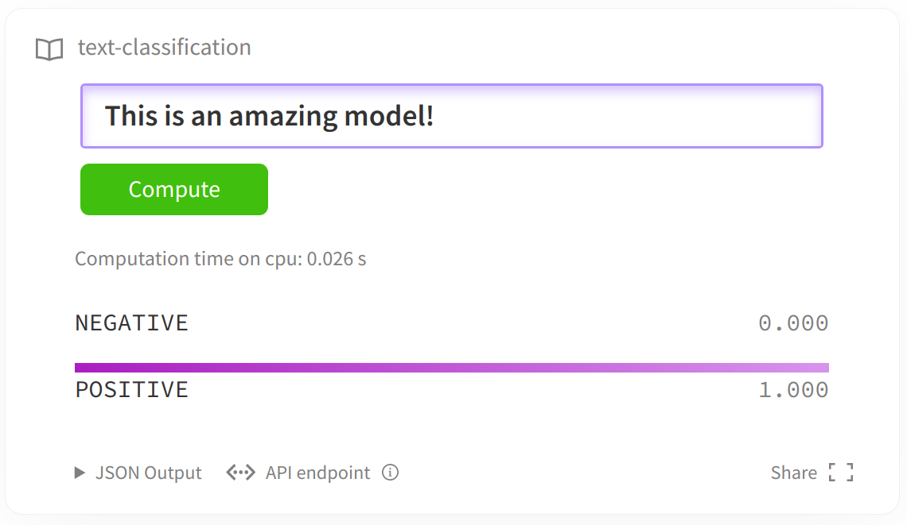

# 文本分类

我们将展示如何使用 🤗
Transformers代码库中的模型来解决文本分类任务，任务来源于[GLUE Benchmark](https://gluebenchmark.com/).



对于以上任务，我们将展示如何使用简单的Dataset库加载数据集，同时使用transformer中的Trainer接口对预训练模型进行微调。

GLUE榜单包含了9个句子级别的分类任务，分别是：

- [CoLA](https://nyu-mll.github.io/CoLA/) (Corpus of Linguistic Acceptability) 鉴别一个句子是否语法正确.
- [MNLI](https://arxiv.org/abs/1704.05426) (Multi-Genre Natural Language Inference) 给定一个假设，判断另一个句子与该假设的关系：entails,
  contradicts 或者 unrelated。
- [MRPC](https://www.microsoft.com/en-us/download/details.aspx?id=52398) (Microsoft Research Paraphrase Corpus)
  判断两个句子是否互为paraphrases.
- [QNLI](https://rajpurkar.github.io/SQuAD-explorer/) (Question-answering Natural Language Inference) 判断第2句是否包含第1句问题的答案。
- [QQP](https://data.quora.com/First-Quora-Dataset-Release-Question-Pairs) (Quora Question Pairs2) 判断两个问句是否语义相同。
- [RTE](https://aclweb.org/aclwiki/Recognizing_Textual_Entailment) (Recognizing Textual Entailment)判断一个句子是否与假设成entail关系。
- [SST-2](https://nlp.stanford.edu/sentiment/index.html) (Stanford Sentiment Treebank) 判断一个句子的情感正负向.
- [STS-B](http://ixa2.si.ehu.es/stswiki/index.php/STSbenchmark) (Semantic Textual Similarity Benchmark)
  判断两个句子的相似性（分数为1-5分）。
- [WNLI](https://cs.nyu.edu/faculty/davise/papers/WinogradSchemas/WS.html) (Winograd Natural Language Inference)
  Determine if a sentence with an anonymous pronoun and a sentence with this pronoun replaced are entailed or not.

对于以上任务，我们将展示如何使用简单的Dataset库加载数据集，同时使用transformer中的`Trainer`接口对预训练模型进行微调。

```python
GLUE_TASKS = ["cola", "mnli", "mnli-mm", "mrpc", "qnli", "qqp", "rte", "sst2", "stsb", "wnli"]
```


### Step1 导入库

```python
import torch
import numpy as np
from transformers import AutoTokenizer,AutoModelForSequenceClassification,TrainingArguments,Trainer
from datasets import load_dataset
import evaluate

task = "sst2"
model_checkpoint = "distilbert-base-uncased"
```

### Step2 数据预处理

使用GLEU中的SST-2数据集， 判断一个句子的情感正负向。
```python
# 加载数据集 和 预处理
dataset = load_dataset(path="glue", name=task)
tokenizer = AutoTokenizer.from_pretrained(model_checkpoint,use_fast=True)

def preprocess_fn(examples):
    return tokenizer(examples["sentence"], truncation=True, max_length=512)

tokenized_dataset = dataset.map(preprocess_fn,batched=True)
print(tokenized_dataset)
labels =  tokenized_dataset['train'].features['label'].names
print("分类标签:",labels)
```

### Step3 加载模型

```python
# 加载模型

model = AutoModelForSequenceClassification.from_pretrained(model_checkpoint, num_labels=len(labels))  # 只有俩个分类


# 模型预测函数
def model_predict(sentences):
    results = []
    inputs = tokenizer(sentences, truncation=True, max_length=512, return_tensors="pt", padding=True).to("cpu")
    model.to("cpu")
    model.eval()

    with torch.no_grad():
        outputs = model(**inputs)
        logits = outputs.logits
        probs = torch.argmax(torch.softmax(logits, dim=-1), dim=-1)
        for prob in probs:
            results.append(labels[int(prob.item())])

    return results


sentences = ["I really not like this movie", "this song is great"]
print("训练前的模型：", model_predict(sentences))
```

### Step4 制定评估指标

```python
# 加载评估指标

metirc = evaluate.load(path="glue", config_name=task)

def compute_metric(eval_pred):
    predictions,labels = eval_pred
    predictions = np.argmax(predictions,axis=1)
    return metirc.compute(predictions=predictions, references=labels)
```

### Step5 设置训练参数

```python
# 设置训练参数

train_args = TrainingArguments(
    output_dir="outputs",
    logging_dir="logs",
    logging_strategy="epoch",
    logging_steps=10,
    report_to="tensorboard",
    num_train_epochs=3,
    per_device_train_batch_size=8,
    per_device_eval_batch_size=8,
    gradient_accumulation_steps=4,
    weight_decay=0.01,
    load_best_model_at_end=True,
    learning_rate=2e-5,
    save_strategy="epoch",
    save_total_limit=1,
    eval_strategy="epoch",
)
```

### Step6 训练模型

```python
# 训练模型
model.train()
trainer = Trainer(
    model=model,
    args=train_args,
    compute_metrics=compute_metric,
    train_dataset=tokenized_dataset["train"].select(range(10000)),
    eval_dataset=tokenized_dataset['validation'],
    tokenizer=tokenizer,
)

trainer.train() # 模型训练

trainer.evaluate() # 评估模型

text = ["I like that song","I really hate this movie. It's disaster!","I really not like this movie", "this song is great"]
results = model_predict(text)
print("训练后的模型：:",results)
```

### Step7 上传模型到hub

[上传模型到hugging face model hub](https://huggingface.co/docs/transformers/model_sharing)


