# 第一章：机器学习基础概念

## 什么是机器学习？

机器学习（Machine Learning, ML）：通过算法让计算机从数据中自动学习规律，并利用学习到的模型进行预测或决策，而无需显式编程。

## 监督学习 vs 非监督学习 vs 强化学习


### 监督学习 (Supervised Learning)
- **定义**: 在监督学习中，模型通过带标签的数据集进行训练。每个输入数据都有一个对应的输出标签。
- **应用示例**: 图像分类、垃圾邮件检测、房价预测等。
- **优点**: 准确性高，适用于已知类别的情况。
- **缺点**: 需要大量的标注数据，成本较高。

### 非监督学习 (Unsupervised Learning)
- **定义**: 非监督学习使用没有标签的数据集进行训练。模型试图从数据中发现潜在的模式或结构。
- **应用示例**: 聚类分析、降维（PCA）、推荐系统等。
- **优点**: 成本较低，适用于未知结构的数据。
- **缺点**: 结果解释难度较大，可能不如监督学习准确。

### 强化学习 (Reinforcement Learning)
- **定义**: 强化学习是一种试错的学习方法。智能体在环境中执行动作，并根据环境反馈的奖励信号调整策略以最大化累积奖励。
- **应用示例**: 游戏AI、机器人控制、自动驾驶等。
- **优点**: 适用于动态环境，能够处理复杂的决策问题。
- **缺点**: 训练时间长，需要模拟大量环境互动。

## 模型评估：准确率、精确率、召回率、F1 值

### 分类指标

分类结果 在深入研究分类指标之前，我们必须了解以下概念：

+ 真正例 (TP)：模型正确预测正类的情况。
+ 假正例 (FP)：模型预测为正类，但实际类为负类的情况。
+ 真反例 (TN)：模型正确预测负类的情况。
+ 假反例 (FN)：模型预测为阴性类别，但实际类别为阳性的情况。

#### 准确度 

准确率是最直接的分类指标，衡量正确预测的比例。虽然准确率易于理解和计算，但在类别不平衡的情况下，可能会产生误导。在这种情况下，考虑其他指标是至关重要的。

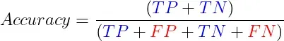

+ 易于理解和沟通，并提供对模型性能的简单评估。
+ 不适合不平衡的类别，因为它可能有利于多数类别。
+ 无法区分假阳性和假阴性。
+ 应与其他指标结合使用。

这是一种在 Python 中计算准确度得分的方法。我们可以使用以下代码将模型预测的值 ( y_pred ) 与真实值 ( y_test ) 进行比较：

```python
from sklearn.metrics import precision_score 
# 计算模型的精确度得分

model_precision = precision_score(y_test, y_pred) 

print("Precision:", model_precision)

```

#### 混淆矩阵

混淆矩阵是一个表格，总结了分类模型的表现，通过比较预测值和实际值。它为我们提供了一个模型表现的直观表示，帮助识别模型的错误之处。它显示了我们的所有四个分类结果。混淆矩阵提供了模型性能的直观表示，并有助于识别模型在哪里犯了错误。

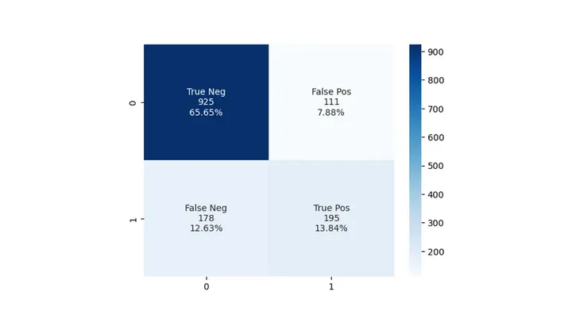

+ 提供真阳性、假阳性、真阴性和假阴性的详细分类。
+ 深入了解每个类别的模型性能，有助于识别弱点和偏差。
+ 作为计算各种指标的基础，例如精确度、召回率、F1 分数和准确度。
+ 可能更难以解释和沟通，因为它不提供整体模型性能的单一值（出于比较目的可能需要该值）。

在 Python 中绘制混淆矩阵的一种简单方法是：

```python
from sklearn.metrics import confusion_matrix, ConfusionMatrixDisplay

# 计算混淆矩阵
conf_matrix = confusion_matrix(y_test, y_pred)

# 展示混淆矩阵
disp = ConfusionMatrixDisplay(confusion_matrix=conf_matrix, display_labels=model.classes_)
disp.plot()

```

#### 精确度

精确度，就是我们模型预测出来的正类中所占的份额。

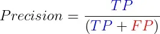

这个指标，特别在那些把假阳性看得比较重的场景下格外重要，比如说过滤垃圾邮件或者是医学上的诊断。但光有精确度还不够，因为它没办法告诉我们假阴性的情况，所以一般会跟召回率一起搭配使用。

+ 在误报的代价特别大的情况下，精确度就显得尤为关键了。
+ 易于理解和沟通。
+ 但它就是不涉及那些被模型错过的正类，即假阴性的数量。
+ 适用于不平衡数据。但是，它应该与其他指标结合使用，因为高精度可能会以牺牲不平衡数据集的召回率为代价

#### 召回率

召回率（灵敏度） 召回率，也叫灵敏度，是评估在所有真正的正例中，有多少被我们的模型正确识别出来的比例。

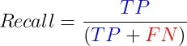

在那些错过真阳性的代价极其重大的场合——比如癌症筛查或者防范信用诈骗，或是在那种正类相对较少的数据集里——召回率的重要性不言而喻。正如召回率需要和精确率一样的搭档一样，为了达到一种评估的平衡，召回率也需要和其他指标一并参考。

+ 在错失真阳性的后果非常严重时，召回率显得格外关键。
+ 易于理解和沟通。
+ 不考虑误报的数量。
+ 适用于不平衡数据。然而，它应该与其他指标结合起来，因为高召回率可能会以牺牲不平衡数据集的精度为代价。

#### F1-分数

F1 分数是精确率和召回率的调和平均值，提供了平衡两者的单一指标。

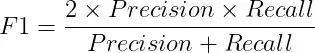

当误报和漏报同样重要并且您寻求精确率和召回率之间的平衡时，F1 分数非常有用。

+ F1-Score 平衡精确度和召回率：当误报和漏报都很重要时很有用。
+ 对于不平衡的数据特别有用，在这种情况下，需要在精确度和召回率之间进行权衡。
+ 偏向于具有相似精度和召回率的模型，这可能并不总是令人满意的。
+ 可能不足以比较不同模型的性能，特别是当模型在误报和漏报之间具有不同的权衡时。

一次性获得准确率、召回率和 F1 分数的最简单方法是使用 scikit-learn 的分类报告：

```python
from sklearn.metrics import classification_report  # 修正导入语句，应该在import和classification_report之间加上空格

# 生成分类报告
# 该报告包括了精确度、召回率、F1分数等关键指标
class_report = classification_report(y_test, y_pred) 

# 打印分类报告
print(class_report)

```

#### 工作特性曲线下面积（AUC）

AUC衡量的是在不同的判定门槛下，模型识别正类的能力与误将负类判为正类的风险之间的平衡。AUC值满分为1，代表模型预测能力无懈可击，而得分为0.5则意味着模型的预测不过是碰运气。在评估和比较多个模型的表现时，AUC尤其有价值，但为了深入掌握每个模型在各个方面的优劣，最好还是将它与其他性能指标一并参考。

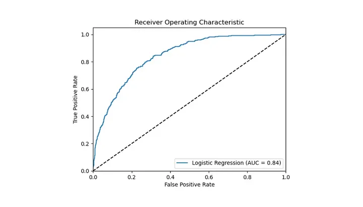

+ 评估各种分类阈值的模型性能。
+ 适用于不平衡的数据集。
+ 可用于比较不同模型的性能。
+ 假设误报和漏报具有相同的成本。
+ 非技术利益相关者难以解释，因为它需要了解 ROC 曲线。
+ 可能不适合具有少量观测值的数据集或具有大量类别的模型。

我们可以使用以下代码计算 AUC 分数并绘制 ROC 曲线：

```python
# 从sklearn.metrics模块导入roc_auc_score和roc_curve函数用于计算AUC分数和绘制ROC曲线，同时导入matplotlib.pyplot用于绘图
from sklearn.metrics import roc_auc_score, roc_curve 
import matplotlib.pyplot as plt 

# 使用模型对测试集X_test进行概率预测，取正类预测概率为真阳性率的依据
y_pred_proba = my_model.predict_proba(X_test)[:, 1] 

# 利用真实标签y_test和预测概率y_pred_proba计算AUC分数，评估模型的整体性能
auc_score = roc_auc_score(y_test, y_pred_proba) 

# 基于真实标签和预测概率，计算ROC曲线的假阳性率（fpr）和真阳性率（tpr），及不同阈值
fpr, tpr, Thresholds = roc_curve(y_test, y_pred_proba) 

# 使用matplotlib绘制ROC曲线，展示模型的性能。曲线下的面积（AUC）越大，模型性能越好
plt.plot(fpr, tpr, label='My Model (AUC = %0.2f)' % auc_score) 

# 绘制对角线，表示随机猜测的性能水平，作为性能的基准线
plt.plot([0, 1], [0, 1], 'k--') 

# 设定图像的x轴和y轴的显示范围
plt.xlim([0.0, 1.0]) 
plt.ylim([0.0, 1.05]) 

# 设置x轴标签为“误报率”和y轴标签为“真阳性率”，即ROC曲线的标准轴标签
plt.xlabel('误报率') 
plt.ylabel('真阳性率') 

# 设置图表标题为“接收器操作特征”，即ROC曲线的常见名称
plt.title('接收器操作特征') 

# 添加图例，位于图的右下角，展示模型及其AUC分数
plt.legend(loc="lower right") 

# 显示绘制的图像
plt.show()

```

#### 对数损失（交叉熵损失)

对数损失用来评估模型预测准确性的一种方法，它对每次预测的正确与否进行奖惩。 这种度量方式通过惩罚错误的预测同时奖励正确的预测来工作。如果对数损失的值越低，意味着模型的性能越好，而当这个值达到0时，就代表这个模型能够完美地进行分类。

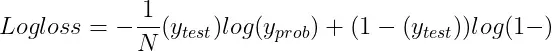

+ N是观测值的数量。
+ y_test是二元分类问题的真实标签（0 或 1）。
+ y_prob是标签为 1 的预测概率。

当你需要对模型的概率预测进行评估时，比如在应用逻辑回归或者神经网络模型的情况下，对数损失就显得尤为重要了。 为了能更深入地掌握模型在各个分类上的表现，最好是将对数损失与其他评估指标一起考虑使用。

+ 概率预测：衡量输出概率估计的模型的性能，鼓励经过良好校准的预测。
+ 对数损失可用于比较不同模型的性能或优化单个模型的性能。
+ 适用于不平衡数据。
+ 对极端概率预测高度敏感，这可能会导致错误分类实例的巨大惩罚值。
+ 可能难以向非技术利益相关者解释和沟通。

### 回归指标

#### 平均绝对误差（MAE）

平均绝对误差（MAE）是用来计算预测值和实际值之间差距绝对值的平均量。

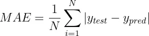

+ N是数据点的数量。
+ y_pred是预测值。
+ y_test是实际值。

**概括：**

+ 易于解释：表示平均误差大小。
+ 对异常值的敏感度低于均方误差 (MSE)。
+ 无错误方向：不表示高估或低估。
+ 在某些情况下可能无法捕获极端错误的影响。

```python

from sklearn.metrics import mean_absolute_error  # 修正函数名称，应为小写的 'mean_absolute_error'

# 计算真实值与预测值之间的平均绝对误差 (MAE)
mae = mean_absolute_error(y_true, y_pred)  # 计算MAE

# 打印MAE值，以评估模型预测的准确性
print("MAE:", mae)

```

#### 均方误差（MSE）

均方误差（MSE）用于计算预测值与实际值差异的平方后的平均数。

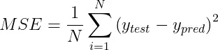

MSE特别对离群值敏感，这是因为它对于较大的误差施加了更重的惩罚，远超过小误差。这一特性根据具体的应用场景，既可能是一个优势也可能是一个劣势。 概括：

+ 对极端错误更加敏感。
+ 平方误差值可能不如绝对误差直观。
+ 与平均绝对误差 (MAE) 相比，受异常值的影响更大。

#### 均方根误差（RMSE）

均方根误差 (RMSE) 是均方误差的平方根。

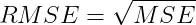

RMSE同样对离群值敏感，和MSE一样，对较大的误差给予较重的惩罚。不过，RMSE的一个显著优势在于它的单位和目标变量保持一致，这使得RMSE更加易于理解和解释。 概括：

+ 对极端错误更加敏感。
+ 与目标变量相同的单位：
+ 与平均绝对误差 (MAE) 相比，受异常值的影响更大。

```python

from sklearn.metrics import mean_squared_error  # 注意修正导入函数名的大小写

# 利用模型对数据集X进行预测，得到预测值y_pred
y_pred = model.predict(X) 

# 计算实际值y和预测值y_pred之间的均方误差（MSE）
mse = mean_squared_error(y, y_pred)  # 注意修正函数名的大小写

# 通过对MSE取平方根，计算均方根误差（RMSE），这一步使得误差单位与目标变量单位一致
rmse = np.sqrt(mse) 

# 输出均方根误差（RMSE），以评估模型预测的准确性
print('Root Mean Squared Error:', rmse)

```

#### 平均绝对百分比误差（MAPE）

平均绝对百分比误差（MAPE）是一个衡量预测准确性的指标，它通过计算预测值与实际值之间差异的百分比，然后取这些百分比差异的平均值来实现。MAPE的计算方式可以这样表达：

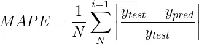

在对比不同模型性能或判断误差的重要程度时，MAPE展现了其独到的价值。 但是，当涉及到接近零的数值时，MAPE的应用就会遇到挑战，因为这时的百分比误差可能会激增，变得异常巨大。

+ 相对误差指标：可用于比较不同尺度的模型性能。
+ 易于解释：以百分比表示。
+ 零值未定义，这可能发生在某些应用程序中。
+ 不对称：高估小实际值的误差，低估大实际值的误差。

Scikit learn 没有 MAPE 函数，但我们可以使用以下方法自己计算：

```python

# 定义一个函数来计算平均绝对百分比误差（MAPE）
def mape(y_true, y_pred): 
    # 计算真实值与预测值之间的绝对差异，然后除以真实值，最后乘以100转换为百分比
    return np.mean(np.abs((y_true - y_pred) / y_true)) * 100

# 使用定义好的MAPE函数，传入真实值y_true和预测值y_pred，计算MAPE
mape_value = mape(y_true, y_pred)  # 修正变量名以避免与函数名相同

# 打印MAPE值，评估模型预测的平均误差百分比
print("MAPE:", mape_value)  # 修正语法错误

```

#### R 平方（决定系数)

R平方衡量了模型预测值与实际值之间的一致性，通过计算模型能解释的目标变量方差的比例来评估。具体来说，R平方的计算公式如下：

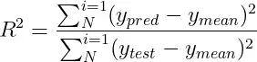

+ y_mean是实际值的平均值。
+ y_pred是预测值。
+ y_test是实际值。

R平方的取值介于0到1之间，其中值越接近1意味着模型的预测能力越强。但是，R平方也存在一定的限制，比如说，即使加入了与目标变量无关的特征，其值也有可能上升。 概括：

+ 代表解释方差的比例，使其易于理解和沟通。
+ 对目标变量的规模不太敏感，这使得它更适合比较不同模型的性能。
+ 偏向于具有许多功能的模型，这可能并不总是令人满意的。
+ 不适合评估预测变量和目标变量之间不存在线性关系的模型。
+ 可能会受到数据中异常值的影响。

```python
from sklearn.metrics import r2_score 


# 使用r2_score函数计算真实值y_true和预测值y_pred之间的R平方值
r_squared = r2_score(y_true, y_pred) 

# 输出R平方值，以评估模型解释目标变量方差的能力
print("R-squared:", r_squared)

```


#### 调整后的 R 平方（Adjusted R-Squared）

Adjusted R-Squared 是对R平方（ R-Squared）的改良，它在计算过程中考虑到了模型中包含的特征数量，从而对模型复杂度进行了调整。调整R平方的计算公式是这样的：

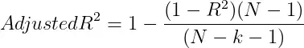

+ N是数据点的数量。
+ k是特征的数量。

调整后的 R-Squared 可以通过惩罚具有过多特征的模型来帮助防止过度拟合。 概括：

+ 修改 R 平方，调整模型中预测变量的数量，使其成为比较具有不同预测变量数量的模型性能的更合适的指标。
+ 对目标变量的规模不太敏感，这使得它更适合比较不同模型的性能。
+ 惩罚额外变量：与 R 平方相比，降低过度拟合风险。
+ 不适合评估预测变量和目标变量之间不存在线性关系的模型。
+ 可能会受到数据中异常值的影响。

```python

from sklearn.metrics import r2_score 

# 计算模型的R平方值，即模型的解释能力
r_squared = r2_score(y, y_pred) 

# 为了更准确地评估模型性能，计算调整后的R平方值
heroes_count = len(y)  # 观测值数量，类比为武林中的英雄人数
techniques_count = X.shape[1]   # 特征数量，类比为模型中的武学技巧数

# 调整后的R平方值的计算考虑了模型中的特征数量
adj_r_squared = 1 - (((1 - r_squared) * (heroes_count - 1)) / (heroes_count - techniques_count - 1))

# 输出调整后的R平方值
print("调整后的R平方：", adj_r_squared)
```

## 交叉验证与模型选择

###  什么是交叉验证（Cross Validation）？

交叉验证是一种评估机器学习模型泛化能力的方法，通过将数据划分为多个“训练-验证”子集，多次训练评估，从而更稳定地估计模型性能。

#### 🎯 为什么使用交叉验证？

+ 防止 过拟合 或 欠拟合
+ 得到更稳定的评估结果
+ 支持超参数优化和模型选择

#### 常见的交叉验证方法

##### （1）K 折交叉验证（K-Fold）

将数据集划分为 K 个子集（fold），每次用 1 个子集作为验证集，其余 K-1 个作为训练集，重复 K 次，最后平均性能。

**优点**：适用于小数据集，评估稳定
**缺点**：K 越大，计算成本越高

```python
from sklearn.model_selection import KFold, cross_val_score
from sklearn.linear_model import LogisticRegression
from sklearn.datasets import load_iris

X, y = load_iris(return_X_y=True)
model = LogisticRegression()

kf = KFold(n_splits=5, shuffle=True, random_state=42)
scores = cross_val_score(model, X, y, cv=kf)
print("每折准确率:", scores)
print("平均准确率:", scores.mean())
```

##### （2）留一法（Leave-One-Out, LOOCV）

每次只用一个样本做验证，剩下的全部做训练，重复 n 次（n 为样本数）。

**优点**：适用于小数据量
**缺点**：计算成本极高

```python
from sklearn.model_selection import LeaveOneOut
loo = LeaveOneOut()
scores = cross_val_score(model, X, y, cv=loo)
```

##### （3）分层 K 折（Stratified K-Fold）

用于分类问题，在每个 fold 中保持各类样本的比例与整体数据一致。

```python
from sklearn.model_selection import StratifiedKFold

skf = StratifiedKFold(n_splits=5, shuffle=True, random_state=42)
scores = cross_val_score(model, X, y, cv=skf)
```

##### （4）重复 K 折（Repeated K-Fold）

多次重复 K 折验证，适合小数据集减少偶然性。

```python
from sklearn.model_selection import RepeatedKFold
rkf = RepeatedKFold(n_splits=5, n_repeats=10, random_state=42)
```

### 模型选择（Model Selection）

在训练过程中，我们通常要比较多个模型或多个**超参数组合**，选出表现最佳的模型。

#### 🎯 怎么做模型选择？

+ 使用交叉验证对每个模型进行评分
+ 比较平均得分，选出最优模型

### 超参数调优与网格搜索

#### GridSearchCV 示例：

```python
from sklearn.model_selection import GridSearchCV

param_grid = {'C': [0.1, 1, 10]}
grid = GridSearchCV(LogisticRegression(), param_grid, cv=5)
grid.fit(X, y)

print("最佳参数：", grid.best_params_)
print("最佳分数：", grid.best_score_)
```

### 交叉验证与训练/测试划分的区别

| 项目               | 训练/测试划分        | 交叉验证                |
|--------------------|----------------------|--------------------------|
| 划分方式           | 一次性划分           | 多次交叉划分            |
| 评估稳定性         | 容易受数据划分影响   | 更稳定、全面            |
| 是否用于小数据集   | 不推荐               | 推荐                     |
| 计算成本           | 低                   | 高                       |

### 交叉验证方法比较

| 方法               | 特点                     | 是否推荐   |
|--------------------|--------------------------|------------|
| K 折交叉验证        | 通用、稳定、经典         | ✅ 强烈推荐 |
| Stratified K-Fold  | 适合分类任务              | ✅ 更优选择 |
| Leave-One-Out      | 稳定但计算量大            | ⚠️ 小数据用 |
| Repeated K-Fold    | 多次验证更稳健            | ✅          |
| ShuffleSplit       | 随机划分多次              | ✅ 适合大数据 |


## 训练集 / 验证集 / 测试集划分

### 一、三种数据集的定义

| 数据集       | 作用描述                 |
|--------------|--------------------------|
| **训练集**（Training Set）   | 用于拟合模型（模型学习的对象） |
| **验证集**（Validation Set） | 用于调参和模型选择，不参与训练 |
| **测试集**（Test Set）       | 用于最终评估模型泛化性能       |

### 二、为什么要划分这三种数据集？

+ 防止过拟合：模型在训练集上学得太好，泛化差。
+ 验证集用于选择最佳超参数或模型。
+ 测试集是“模型的期末考试”，不能被用于训练或调参。

### 三、常见划分比例

| 划分方式                     | 比例示例         |
|------------------------------|------------------|
| 训练 / 测试                  | 80% / 20%        |
| 训练 / 验证 / 测试           | 60% / 20% / 20%  |
| 小数据集时用交叉验证替代验证集 | -                |

> ✅ 注意：验证集和测试集要互不重叠，否则评估会不准确。

###  四、Python 实现示例（使用 sklearn）

```python
from sklearn.model_selection import train_test_split
from sklearn.datasets import load_iris

X, y = load_iris(return_X_y=True)

# 首先划分训练集和临时集（验证+测试）
X_train, X_temp, y_train, y_temp = train_test_split(
    X, y, test_size=0.4, random_state=42
)

# 再从临时集中划分验证集和测试集
X_val, X_test, y_val, y_test = train_test_split(
    X_temp, y_temp, test_size=0.5, random_state=42
)

print("训练集大小:", X_train.shape)
print("验证集大小:", X_val.shape)
print("测试集大小:", X_test.shape)
```

###  五、图示理解（60%/20%/20%）

```text
完整数据集: ──────────────────────────────
              ↓
训练集（60%） 验证集（20%） 测试集（20%）
```

### 六、三种数据划分方式比较表格（Markdown 源码）

| 数据集类型     | 用途                           | 是否参与训练 | 是否用于调参 | 是否用于最终评估 |
|----------------|--------------------------------|--------------|--------------|------------------|
| 训练集         | 拟合模型参数（如权重）         | ✅ 是         | ❌ 否         | ❌ 否             |
| 验证集         | 选择模型或超参数                | ❌ 否         | ✅ 是         | ❌ 否             |
| 测试集         | 评估泛化性能（最终指标）        | ❌ 否         | ❌ 否         | ✅ 是             |


