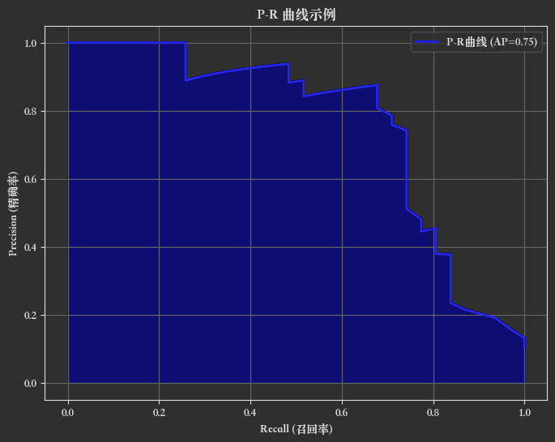
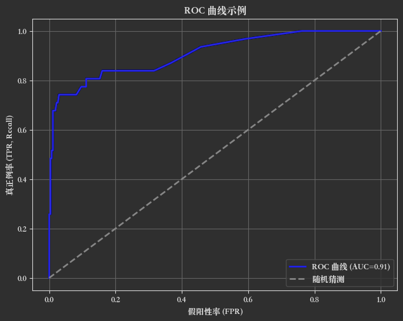

# 第二章：模型评估

## 一、准确率

### 1️⃣ 什么是准确率（Accuracy）？

准确率（Accuracy）是分类模型最常用的评估指标之一。它表示模型正确预测的样本数量占总样本数量的比例。

> 准确率 = 正确预测的数量 ÷ 总预测的数量

### 2️⃣ 数学公式

如果你有一个二分类问题（正例和负例），混淆矩阵可以表示为：

|              | 预测正例 (P') | 预测负例 (N') |
|--------------|-----------|-----------|
| **真实正例 (P)** | TP (真阳性)  | FN (假阴性)  |
| **真实负例 (N)** | FP (假阳性)  | TN (真阴性)  |

其中：

+ TP：预测为正例，且真实为正例。
+ TN：预测为负例，且真实为负例。
+ FP：预测为正例，但真实为负例。
+ FN：预测为负例，但真实为正例。

那么准确率公式为：

$$
\text{Accuracy} = \frac{TP + TN}{TP + TN + FP + FN}
$$

### 3️⃣ Python 代码实现

下面用 scikit-learn 举个例子：

```python
from sklearn.metrics import accuracy_score

# 假设真实标签和预测标签如下
y_true = [1, 0, 1, 1, 0, 1, 0]
y_pred = [1, 0, 1, 0, 0, 1, 1]

# 计算准确率
accuracy = accuracy_score(y_true, y_pred)

print("准确率：", accuracy)
```

!!! success "输出结果"

    准确率：0.7142857142857143

### 4️⃣ 准确率的优缺点

#### ✅ 优点：

+ 简单直观，易于理解。
+ 适用于类别平衡的数据集。

#### ❌ 缺点：

+ 当类别分布不均衡（即样本类别极度不平衡）时，准确率可能具有误导性。
+ 例如，95% 的样本是负例，只要模型全预测负例，准确率就能达到 95%，但模型其实没有真正学到有用的信息。

### 5️⃣ 适用场景

+ 适合 **类别分布均衡** 的二分类或多分类问题。
+ 不适合类别极不平衡的情况（此时更推荐使用 F1-score、AUC-ROC、召回率、精确率等指标）。

## 二、精确率与召回率

### 1️⃣ 精确率（Precision）

精确率衡量的是：在所有被模型预测为正例的样本中，有多少是真正的正例。

> 换句话说，它关注 预测为正例的样本中有多少是准确的。

$$
\text{Precision} = \frac{TP}{TP + FP}
$$

其中：

+ TP（True Positive）：真正例，预测为正例且真实也是正例。
+ FP（False Positive）：假阳性，预测为正例但真实是负例。

### 2️⃣ 召回率（Recall）

召回率衡量的是： 在所有真实正例的样本中，有多少被模型成功预测为正例。

它关注 模型捕获正例的能力。

$$
\text{Recall} = \frac{TP}{TP + FN}
$$

其中：

+ FN（False Negative）：假阴性，真实为正例但被预测为负例。

### 3️⃣ 代码实现

使用 scikit-learn 中的 precision_score 和 recall_score：

```python
from sklearn.metrics import precision_score, recall_score

# 假设真实标签和预测标签
y_true = [1, 0, 1, 1, 0, 1, 0]
y_pred = [1, 0, 1, 0, 0, 1, 1]

# 计算精确率
precision = precision_score(y_true, y_pred)
print("精确率：", precision)

# 计算召回率
recall = recall_score(y_true, y_pred)
print("召回率：", recall)
```

!!! success "输出结果"

    精确率：0.75
    召回率：0.6

### 4️⃣ 二者关系与权衡

+ 精确率高：预测为正例时，更有把握是真的正例（误报少）。
+ 召回率高：能找到更多的真实正例（漏报少）。

但是，二者通常是一对“跷跷板”：

如果你想提高召回率，通常需要让模型更“宽松”，多预测正例，可能会引入更多的假阳性，导致精确率下降；反之，若提高精确率，召回率可能下降。

### 5️⃣ 适用场景

| 场景         | 更看重 | 解释                        |
|------------|-----|---------------------------|
| **垃圾邮件检测** | 精确率 | 不希望正常邮件被误判为垃圾邮件。          |
| **癌症筛查**   | 召回率 | 尽可能发现所有的癌症患者（不怕误报，但怕漏报）。  |
| **欺诈检测**   | 召回率 | 不想漏掉任何潜在的欺诈行为，宁可多抓一些可疑交易。 |
| **广告点击预测** | 精确率 | 不希望把不相关的广告推送给用户。          |

### 6️⃣ F1-score：综合指标

F1-score 是 精确率（Precision）和召回率（Recall） 的调和平均数，是一个综合考虑分类模型性能的指标，尤其适合：

+ 样本不平衡（如疾病预测、欺诈检测）
+ 既不能漏掉真阳性（高 Recall），也不能误报太多（高 Precision）的任务


当你想要平衡 精确率 和 召回率 时，可以使用 F1-score：

$$
\text{F1} = 2 \times \frac{\text{Precision} \times \text{Recall}}{\text{Precision} + \text{Recall}}
$$

它是它们的调和平均数。
常用于二者都重要的场景。

F1-score 是在 Precision 和 Recall 存在矛盾时，用于权衡这两个指标，特别适合样本不平衡分类任务的重要评估指标。

### 7️⃣ 混淆矩阵中的直观理解

| 符号 | 含义                                   | 举例（肿瘤检测）              |
|------|----------------------------------------|-------------------------------|
| TP   | 真阳性：正类被正确预测为正类           | 检测出患病者确实患病          |
| FP   | 假阳性：负类被错误预测为正类           | 检测出患病者实际没病（误判）  |
| FN   | 假阴性：正类被错误预测为负类           | 没检测出患病者其实有病（漏判）|
| TN   | 真阴性：负类被正确预测为负类           | 正常人被正确识别为正常        |

基于混淆矩阵：

|              | 预测正例 (P') | 预测负例 (N') |
|--------------|-----------|-----------|
| **真实正例 (P)** | TP        | FN        |
| **真实负例 (N)** | FP        | TN        |

- 精确率：看 **预测正例那一列** → `TP / (TP + FP)`
- 召回率：看 **真实正例那一行** → `TP / (TP + FN)`

| 指标       | 公式                                               | 意义说明                 |
|------------|----------------------------------------------------|--------------------------|
| Accuracy 准确率   | \( \frac{TP + TN}{TP + FP + FN + TN} \)       | 总体预测正确的比例        |
| Precision 精确率 | \( \frac{TP}{TP + FP} \)                         | 预测为正中有多少是真正的正 |
| Recall 召回率     | \( \frac{TP}{TP + FN} \)                         | 实际为正中被预测出来的比例 |
| F1-score         | \( 2 \cdot \frac{Precision \cdot Recall}{Precision + Recall} \) | 精确率与召回率的平衡       |

### 8️⃣ P-R 曲线

P-R 曲线（Precision-Recall Curve），中文叫 **精确率-召回率曲线**，是用来可视化和评价二分类模型性能的曲线。

**横轴**是：召回率（Recall）也叫灵敏度，表示在所有真正例中，模型找回的比例。

**纵轴**是：精确率（Precision）：也叫查准率，表示模型预测为正例中，真正例的比例。

#### 🟩 P-R 曲线的绘制

对于二分类模型（比如逻辑回归、随机森林等），模型通常会输出一个 概率分数，表示样本属于正类的可能性。通过不同的
阈值，把这个分数转换成具体的「正类/负类」标签。

**步骤：**

1️⃣ 从最高分数到最低分数，依次选取不同的阈值。

2️⃣ 对于每个阈值，计算对应的 Precision 和 Recall。

3️⃣ 把每一对 (Recall, Precision) 作为一个坐标点，依次连接，就得到了 P-R 曲线。

#### 🟩 P-R 曲线的意义

+ **召回率高**：模型能识别更多正例，假阳性风险高。
+ **精确率高**：模型预测更准确，假阴性风险高。
+ 二者往往互相制约，P-R 曲线可以全面反映这个权衡关系。

#### 🟩 代码实现

```python
import numpy as np
from sklearn.datasets import make_classification
from sklearn.model_selection import train_test_split
from sklearn.ensemble import RandomForestClassifier
from sklearn.metrics import precision_recall_curve, average_precision_score
import matplotlib.pyplot as plt

plt.rcParams["font.family"] = "Songti SC"

# 1️⃣ 生成二分类模拟数据
X, y = make_classification(n_samples=1000, n_features=20, n_classes=2,
                           n_informative=2, weights=[0.9, 0.1], random_state=42)

# 2️⃣ 划分训练集和测试集
X_train, X_test, y_train, y_test = train_test_split(
    X, y, test_size=0.3, random_state=42, stratify=y
)

# 3️⃣ 使用随机森林进行训练
clf = RandomForestClassifier(n_estimators=100, random_state=42)
clf.fit(X_train, y_train)

# 4️⃣ 得到预测概率
y_scores = clf.predict_proba(X_test)[:, 1]  # 只要正类的概率分数

# 5️⃣ 计算 Precision-Recall 曲线
precision, recall, thresholds = precision_recall_curve(y_test, y_scores)

# 6️⃣ 计算 Average Precision (AP)
ap_score = average_precision_score(y_test, y_scores)

# 7️⃣ 绘制 P-R 曲线
plt.figure(figsize=(8, 6))
plt.plot(recall, precision, color='b', lw=2, label=f'P-R曲线 (AP={ap_score:.2f})')
plt.fill_between(recall, precision, alpha=0.2, color='b')
plt.xlabel('Recall (召回率)')
plt.ylabel('Precision (精确率)')
plt.title('P-R 曲线示例')
plt.legend()
plt.grid(True)
plt.show()
```

!!! success "输出结果"

    

## 三、ROC曲线

ROC 曲线是二分类模型评估的重要可视化工具。

**横轴**：假阳性率（FPR, False Positive Rate）$\text{FPR} = \frac{FP}{FP + TN}$  表示负例被误判为正例的比例。

**纵轴**：真正例率（TPR, True Positive Rate，也叫 Recall）$\text{TPR} = \frac{TP}{TP + FN}$  表示正例被正确预测的比例。

### 🟢 为什么用 ROC 曲线？

ROC 曲线用于观察模型在不同阈值下的表现。
**阈值**：把概率分数转成「正/负」标签的分界线。

随着阈值从 1 ➡ 0，FPR、TPR 都会变化，连成一条曲线，就得到了 ROC 曲线。

### 🟩 如何绘制 ROC 曲线？

1️⃣ 模型输出概率分数（正例分数）。

2️⃣ 取不同的阈值，计算 TPR 和 FPR。

3️⃣ 将所有 (FPR, TPR) 画在坐标系中，连接起来。

### 🟩 理想情况 & 随机情况

+ **理想模型**：TPR 快速上升，曲线非常靠近左上角（0,1）点。
+ **随机模型**：TPR 与 FPR 相等，曲线接近对角线（y=x）。

### 🟩 ROC 曲线下面积（AUC）

ROC 曲线的面积称为 AUC（Area Under Curve）。

+ AUC = 1：完美模型。
+ AUC = 0.5：随机猜测。
+ AUC 越接近 1，模型越好。

### P-R vs ROC：场景对比总结表

| 场景或属性               | ROC 曲线                           | P-R 曲线                                  |
|--------------------------|------------------------------------|-------------------------------------------|
| 数据是否平衡             | 适用于样本平衡                     | 更适用于**样本不平衡（正类稀缺）**        |
| 是否关注负类预测         | 是                                 | 否（只关心正类预测情况）                  |
| 模型表现是否会被负类影响 | 会                                 | 不会                                      |
| 随机模型表现             | 对角线 AUC=0.5                     | Precision 线是一个常数                    |
| 高 FP 模型看起来怎么样   | 可能仍有高 AUC（**误导性高**）      | 会导致 Precision 下降，真实反映模型能力   |
| 可解释性                 | 整体表现                            | 关注“正类”的表现，更接近实际业务需求     |

### 🟢 Python 绘制 ROC 曲线完整示例

```python
import numpy as np
from sklearn.datasets import make_classification
from sklearn.model_selection import train_test_split
from sklearn.ensemble import RandomForestClassifier
from sklearn.metrics import roc_curve, auc
import matplotlib.pyplot as plt

# 1️⃣ 生成二分类不平衡数据
X, y = make_classification(n_samples=1000, n_classes=2, weights=[0.9, 0.1],
                           n_informative=2, n_features=20, random_state=42)

# 2️⃣ 划分数据集
X_train, X_test, y_train, y_test = train_test_split(
    X, y, test_size=0.3, random_state=42, stratify=y
)

# 3️⃣ 训练模型
clf = RandomForestClassifier(n_estimators=100, random_state=42)
clf.fit(X_train, y_train)

# 4️⃣ 获取预测概率
y_scores = clf.predict_proba(X_test)[:, 1]

# 5️⃣ 计算 ROC 曲线
fpr, tpr, thresholds = roc_curve(y_test, y_scores)
roc_auc = auc(fpr, tpr)

# 6️⃣ 绘图
plt.figure(figsize=(8, 6))
plt.plot(fpr, tpr, color='b', lw=2, label=f'ROC 曲线 (AUC={roc_auc:.2f})')
plt.plot([0, 1], [0, 1], color='gray', linestyle='--', lw=2, label='随机猜测')
plt.xlabel('假阳性率 (FPR)')
plt.ylabel('真正例率 (TPR, Recall)')
plt.title('ROC 曲线示例')
plt.legend(loc='lower right')
plt.grid(True)
plt.show()
```

!!! success "输出结果"

    

## 四、余弦距离

### 1️⃣ 基本概念

#### 余弦相似度（cosine similarity）

衡量两个向量在向量空间中的 **方向相似度，与向量的大小无关**。

取值范围：[-1, 1]，其中：

+ 1 → 完全相同方向（最相似）
+ 0 → 垂直（完全无关）
+ -1 → 完全相反方向

#### 余弦距离（cosine distance）

是余弦相似度的“互补距离”： $\text{cosine distance} = 1 - \text{cosine similarity}$

### 2️⃣ 公式

假设有两个向量：

$\mathbf{A} = (A_1, A_2, \ldots, A_n), \quad \mathbf{B} = (B_1, B_2, \ldots, B_n)$

**余弦相似度公式**

$\text{cosine similarity} = \frac{\mathbf{A} \cdot \mathbf{B}}{\|\mathbf{A}\| \|\mathbf{B}\|} = \frac{\sum_{i=1}^n A_i B_i}{\sqrt{\sum_{i=1}^n A_i^2} \sqrt{\sum_{i=1}^n B_i^2}}$

**余弦距离公式**

$\text{cosine distance} = 1 - \text{cosine similarity}$

### 3️⃣ Python 代码示例

```python
import numpy as np
from sklearn.metrics.pairwise import cosine_similarity

# 两个向量
A = np.array([1, 2, 3])
B = np.array([4, 5, 6])

# 计算余弦相似度
cos_sim = cosine_similarity([A], [B])[0][0]
print("余弦相似度:", cos_sim)

# 计算余弦距离
cos_dist = 1 - cos_sim
print("余弦距离:", cos_dist)
```

!!! success "输出结果"

    余弦相似度: 0.9746318461970762

    余弦距离: 0.025368153802923788

### 4️⃣ 与欧氏距离的区别

| 比较维度          | 欧氏距离                          | 余弦距离（相似度）                            |
|---------------|-------------------------------|--------------------------------------|
| **关注重点**      | 向量的 **长度 + 方向**               | 只关注 **方向（夹角）**                       |
| **是否受量纲影响**   | 是，特征量纲差异大时必须归一化处理             | 否，内置归一化，自动忽略大小，仅看方向                  |
| **适用场景**      | KNN、K-Means、回归分析等             | 文本相似度、图像相似度、推荐系统、向量检索等               |
| **常用公式**      | \(\sqrt{\sum (A_i - B_i)^2}\) | \(1 - \frac{A \cdot B}{\|A\|\|B\|}\) |
| **是否与向量长度有关** | 有，向量长度越大距离越大                  | 无，只与方向有关                             |
| **结果范围**      | \([0, +\infty)\)，越小越相似        | \([0, 1]\)，越小越相似（0 表示方向完全一致）         |

### 5️⃣ 应用场景

✅ 文本分析（TF-IDF / Word2Vec / BERT 等向量化结果）

✅ 图像检索 / 向量搜索（相似度度量）

✅ 推荐系统（用户兴趣向量、物品特征向量）

✅ 任何只关心“方向相似度”的场景

## 五、模型评估策略

### 一、模型评估的整体流程

```text
数据准备 → 模型训练 → 模型评估 → 模型选择/调参 → 最终测试
                          ↑
                    重点就在这里！
```

### 二、评估策略核心问题

要解决以下几个核心问题：

| 评估问题              | 示例                       |
|-------------------|--------------------------|
| 如何划分训练/验证/测试集？    | Holdout、交叉验证、时间序列分割      |
| 用什么指标衡量好坏？        | 分类：准确率/F1，回归：MSE，排序：NDCG |
| 如何避免“运气好”的评估结果？   | 多次评估、交叉验证、Bootstrap      |
| 如何根据评估结果调参选模？     | 网格搜索、贝叶斯优化               |
| 模型是否真的能泛化到线上实际数据？ | 留出真实线上数据模拟 A/B 测试        |

### 三、模型评估策略类型详解

#### ✅ 1. 数据划分策略

| 策略                | 说明                           |
|-------------------|------------------------------|
| Holdout（留出法）      | 一次性划分：训练 / 验证 / 测试集          |
| K-Fold 交叉验证       | 将数据分成 K 份轮流作为验证集，平均得分更稳健     |
| Stratified K-Fold | 保持类别比例一致的 K-Fold（分类任务中更准确）   |
| Leave-One-Out     | 每次只留一个样本做验证，极端稳健但计算开销大       |
| 时间序列分割            | 时间敏感任务，训练集必须早于验证集（不可打乱）      |
| Bootstrap         | 有放回采样，可反复模拟训练/评估，多用于小样本或集成模型 |

#### ✅ 2. 评估指标策略（按任务类型）

##### 📌 分类任务（如垃圾邮件识别、图像分类）

| 指标      | 含义                              |
|---------|---------------------------------|
| 准确率     | 所有预测正确样本数 / 总样本数                |
| 精确率     | TP / (TP + FP) —— 预测为正中有多少是真正正例 |
| 召回率     | TP / (TP + FN) —— 所有正样本中预测出来的比例 |
| F1 分数   | 精确率与召回率的调和平均                    |
| AUC-ROC | 真阳率 vs 假阳率曲线下的面积                |
| PR-AUC  | 精确率 vs 召回率曲线下的面积（更适合类别不平衡）      |

##### 📌 回归任务（如房价预测、销售额预测）

| 指标名 | 全称             | 公式                                                                    | 特点                         | Python 函数（sklearn.metrics）       |
|--------|------------------|-----------------------------------------------------------------------|------------------------------|--------------------------------------|
| MSE    | 均方误差         | $\frac{1}{n} \sum (y - \hat{y})^2$                                    | 对离群值敏感，常用于优化     | `mean_squared_error`                |
| RMSE   | 均方根误差       | $\sqrt{\text{MSE}}$                                                   | 单位与目标一致，更直观       | 手动 `np.sqrt(MSE)`                 |
| MAE    | 平均绝对误差     | $\frac{1}{n} \sum \|y - \hat{y}\|$                                    | 对离群值不敏感，鲁棒性强     | `mean_absolute_error`               |
| R²     | 决定系数         | $1 - \frac{SSR}{SST}$                                                 | 越接近 1 越好，衡量拟合程度   | `r2_score`                          |
| MAPE   | 平均绝对百分误差 | $\frac{1}{n} \sum \left\|\frac{y - \hat{y}}{y}\right \| \times 100\%$ | 百分比误差，易理解但对 0 敏感 | 自定义实现                          |


| 指标 | 解释                     | 越小/大越好 | 优点                     | 缺点                        |
|------|--------------------------|--------------|--------------------------|-----------------------------|
| MSE  | 均方误差，误差平方平均  | 越小越好     | 常用于训练优化目标       | 单位是平方，解释不直观     |
| RMSE | MSE 开方，误差的真实量纲 | 越小越好     | 单位与原始一致           | 仍受异常值影响             |
| MAE  | 平均绝对误差             | 越小越好     | 易解释，鲁棒             | 不可导，不适合做 loss      |
| R²   | 解释方差比例             | 越接近 1 越好 | 表示模型能解释多少变异性 | 对非线性模型意义较弱       |
| MAPE | 百分比误差               | 越小越好     | 百分比清晰直观           | 不能用于真实值为 0 的情况  |

| 任务场景                   | 推荐指标     | 原因                             |
|----------------------------|--------------|----------------------------------|
| 对误差敏感                 | MSE / RMSE   | 放大大误差                       |
| 要求稳健不受离群值影响     | MAE          | 对异常值鲁棒                     |
| 希望用“解释比例”衡量拟合程度 | R²           | 表示模型能解释多少变异性         |
| 商业场景，关注“相对误差”   | MAPE         | 百分比误差清晰直观               |

##### 📌 排序/推荐系统任务（如个性化推荐）

| 指标          | 含义                      |
|-------------|-------------------------|
| Precision@K | 前 K 个推荐中有多少是相关的（精确率）    |
| Recall@K    | 所有相关项中前 K 个推荐命中了多少（召回率） |
| NDCG@K      | 归一化折损累计增益，考虑推荐结果的顺序和相关性 |
| MAP@K       | 平均精度，适用于多轮推荐结果评价        |
| Hit Rate@K  | 前 K 个中是否命中至少一个相关项（是否命中） |
| AUC         | 推荐正例得分高于负例的概率           |

#### ✅ 3. 多次评估与置信区间策略

为了防止评估结果“运气好”，可使用以下策略：

+ **重复交叉验证**：例如 10 次 5-Fold（称为 repeated k-fold CV）
+ **Bootstrap 自助法**：重复采样 100~1000 次评估结果，统计平均值和置信区间
+ **置信区间估计**：

```python
import scipy.stats as st

st.t.interval(0.95, len(scores) - 1, loc=np.mean(scores), scale=st.sem(scores))
```

#### ✅ 5. 线上评估策略

##### 📊 A/B 测试

+ 将用户分成两组：
    - A：当前线上模型
    - B：新模型
+ 比较真实用户行为：CTR、转化率、留存等

##### 📦 Shadow Testing（影子测试）

+ 新模型与旧模型同时在线运行，新模型只“听不说”不影响线上
+ 对比两者预测差异，提前预警部署风险

#### ✅ 五、总结图：评估策略选择导图

```text
→ 任务类型？
   ├── 分类
   │     ├── 样本均衡？——准确率 + F1 + ROC
   │     └── 样本不均衡？——PR-AUC + Recall + F1
   ├── 回归
   │     └── MAE / MSE / R²
   ├── 排序/推荐
   │     └── NDCG / MAP / Recall@K
   └── 时间序列
         └── TimeSeriesSplit + MAE/MAPE

→ 数据量大小？
   ├── 小样本 —— K-Fold / Bootstrap
   └── 大样本 —— Holdout + 多次评估

→ 是否线上部署？
   └── A/B 测试 + 监控日志
```

## 六、超参数调优

### 🎯 什么是超参数？

超参数是在模型训练前需要人为指定的参数，例如：

- 学习率 `learning_rate`
- 树深度 `max_depth`
- 正则系数 `alpha`
- KNN 的 `k` 值

它们 **不会通过模型训练过程自动获得**，必须手动设定或通过调参算法搜索。

---

### 🔍 为什么要调优？

+ 同一个模型在不同超参数下表现差异巨大
+ 自动调参能节省大量手工试错成本
+ 找到泛化能力更强、过拟合风险更小的模型

----

### 🧠 常见调参方法

| 方法             | 特点                   |
|----------------|----------------------|
| Grid Search    | 穷举所有可能的组合，计算成本高      |
| Random Search  | 随机采样部分组合，效果好且效率高     |
| 贝叶斯优化          | 利用历史搜索结果建模，预测下一个搜索点  |
| Hyperband/ASHA | 支持提前终止差模型，提高深度学习调参效率 |

#### 1. Grid Search（网格搜索）

**特点**： 穷举所有可能的参数组合，计算量大但覆盖全面。

**适合场景**： 参数组合不多，训练时间允许。

```python
from sklearn.model_selection import GridSearchCV
from sklearn.svm import SVC

param_grid = {
    'C': [0.1, 1, 10],
    'kernel': ['linear', 'rbf']
}
grid = GridSearchCV(SVC(), param_grid, cv=3)
grid.fit(X, y)

print("最佳参数组合：", grid.best_params_)
```

#### 2. Random Search（随机搜索）

**特点**： 随机选取部分参数组合，效率高。

**适合场景**： 参数空间大时（如深度神经网络）。

```python
from sklearn.model_selection import RandomizedSearchCV
from sklearn.ensemble import RandomForestClassifier
from scipy.stats import randint

param_dist = {
    'n_estimators': randint(50, 200),
    'max_depth': randint(3, 10)
}
random_search = RandomizedSearchCV(RandomForestClassifier(), param_dist, n_iter=10, cv=3)
random_search.fit(X, y)

print("最佳参数组合：", random_search.best_params_)
```

#### 3. Bayesian Optimization（贝叶斯优化）

**特点**： 通过概率模型预测最优参数，更智能地选择下一个搜索点。

**适合场景**： 高成本模型、复杂调参空间。

**工具推荐**： Optuna、scikit-optimize

**Optuna 示例：**

```python
import optuna
from sklearn.ensemble import RandomForestClassifier
from sklearn.model_selection import cross_val_score


def objective(trial):
    n_estimators = trial.suggest_int("n_estimators", 50, 200)
    max_depth = trial.suggest_int("max_depth", 3, 15)
    clf = RandomForestClassifier(n_estimators=n_estimators, max_depth=max_depth)
    return cross_val_score(clf, X, y, cv=3).mean()


study = optuna.create_study(direction="maximize")
study.optimize(objective, n_trials=20)

print("最优参数：", study.best_params)
```

#### 4. Hyperband / ASHA（早停算法）

**特点**： 动态资源分配（提前终止表现差的模型），大幅提高效率。

**适合场景**： 神经网络、AutoML。

**工具推荐**： Ray Tune, Keras Tuner

**Ray Tune 示例：**

```python
from ray import tune


def train_model(config):
    model = MyModel(config["lr"], config["dropout"])
    acc = model.train_and_eval()
    tune.report(accuracy=acc)


analysis = tune.run(
    train_model,
    config={"lr": tune.loguniform(1e-4, 1e-1), "dropout": tune.uniform(0.1, 0.5)},
    num_samples=20
)

print("最优配置：", analysis.get_best_config(metric="accuracy", mode="max"))
```

## 七、过拟合和欠拟合

+ **欠拟合**：模型太简单，学不懂数据
+ **过拟合**：模型太复杂，把训练数据背下来了，连噪声也当成规律


### 🔍 欠拟合（Underfitting）

#### ✅ 特征：

+ 训练误差 高
+ 测试误差也 高
+ 模型无法捕捉数据的模式

#### 🎯 原因：

| 原因             | 示例                               |
|------------------|------------------------------------|
| 模型太简单        | 用线性模型拟合非线性数据             |
| 特征不够          | 只用了 1-2 个简单特征                 |
| 训练时间不够      | 神经网络训练 epoch 太少               |
| 过强的正则化      | 惩罚项太强，把模型“压扁”了            |


### 🔍 过拟合（Overfitting）

#### ✅ 特征：

+ 训练误差 低
+ 测试误差 高
+ 模型“记住”了训练数据，无法泛化

#### 🎯 原因：

| 原因             | 示例                               |
|------------------|------------------------------------|
| 模型太复杂        | 使用深度太深的神经网络                |
| 特征维度太高      | 上百维稀疏特征 + 样本太少             |
| 数据量太少        | 少量数据训练出复杂模型                |
| 没有正则化        | 不约束模型，自由过头了                 |

### 🔧 如何解决？

#### ✴️ 欠拟合的应对方法：

+ 使用更复杂的模型（如线性 → 决策树）
+ 增加特征、构造新特征
+ 训练更久，调大 epoch
+ 减小正则化力度

#### ✴️ 过拟合的应对方法：

+ 使用更简单的模型
+ 加强正则化（L1、L2）
+ 使用 Dropout（对神经网络）
+ 增加训练数据
+ 使用交叉验证选择模型
+ 提前停止训练（Early Stopping）

