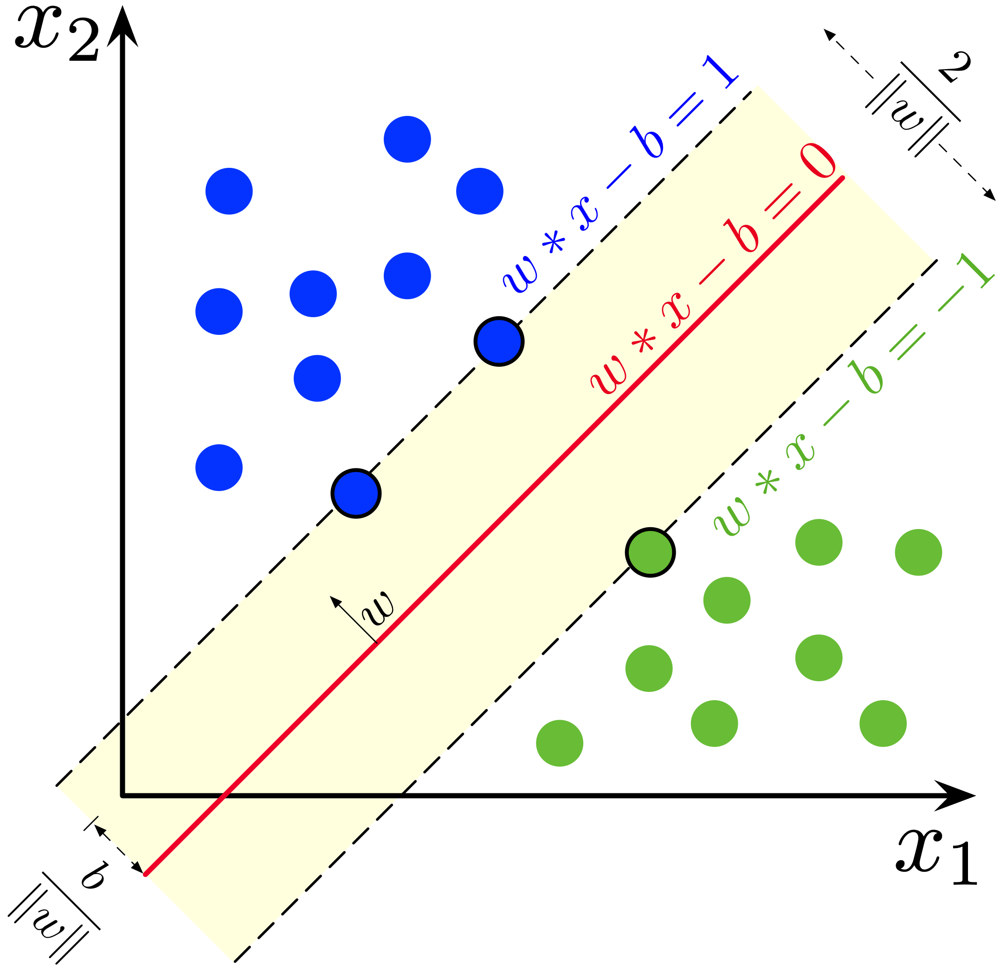

# 第三章：监督学习

## 一、线性模型

### 1.1 线性回归（Linear Regression）

线性回归是一种最基础但非常重要的机器学习算法，主要用于预测连续值。

#### 1. 什么是线性回归？

线性回归的目标是：
> 找到一条最佳的直线，拟合一组点的趋势，从而进行预测。

**比如：**

+ 根据房子的面积预测房价
+ 根据学生的学习时间预测考试成绩

这就是线性回归的经典应用。

#### 2. 一元线性回归公式

假设你有一个变量 x，我们想预测 y，那么模型如下：

$y = wx + b$

+ w：斜率（weight）
+ b：截距（bias）
+ 这就是我们要学的参数

####  3. 目标是什么？

我们希望找到最合适的 w 和 b，使得：

+ 预测值 $\hat{y}$ 尽可能接近真实值 y
+ 损失函数（误差）最小

常用的损失函数是 **均方误差（MSE）**：

$\text{MSE} = \frac{1}{n} \sum_{i=1}^n (y_i - \hat{y}_i)^2$

####  4. 模型训练（梯度下降）

我们可以使用 **梯度下降（Gradient Descent）** 来不断调整 w 和 b，直到 MSE 最小。

#### 5. Python 实战演示（sklearn）

```python
from sklearn.linear_model import LinearRegression
import numpy as np
import matplotlib.pyplot as plt

# 模拟数据：房屋面积 vs 房价
X = np.array([[50], [60], [80], [100], [120]])  # 面积
y = np.array([150, 180, 240, 280, 310])        # 房价（单位：万）

# 创建模型并训练
model = LinearRegression()
model.fit(X, y)

# 预测
X_test = np.array([[90]])
y_pred = model.predict(X_test)
print("预测 90 平米房子的价格：", y_pred[0], "万")

# 可视化
plt.scatter(X, y, color='blue', label='真实数据')
plt.plot(X, model.predict(X), color='red', label='拟合线')
plt.xlabel('面积（平方米）')
plt.ylabel('价格（万）')
plt.title('线性回归：面积 vs 价格')
plt.legend()
plt.show()
```

####  6. 多元线性回归

当我们有多个变量（例如面积、卧室数量、楼层等），模型变成：

$y = w_1x_1 + w_2x_2 + \dots + w_nx_n + b$

Python 训练方式完全相同，只需提供多个特征即可。

####  7. 线性回归的优缺点

##### 优点：

+ 简单直观，易于理解
+ 训练速度快
+ 可解释性强（每个变量的权重可解释）

##### 缺点：

+ 只能处理线性关系
+ 对异常值敏感
+ 不能处理多峰或非线性数据

#### 8. 常见变种

| 模型                         | 特点                                   |
|------------------------------|----------------------------------------|
| 岭回归（Ridge）              | 加入 L2 正则化，防止过拟合             |
| Lasso 回归                   | 加入 L1 正则化，可用于特征选择         |
| 多项式回归                   | 可拟合曲线（非线性）                   |
| 逻辑回归（Logistic Regression） | 虽叫“回归”，其实是分类算法             |


----

### 1.2 逻辑回归（Logistic Regression）

#### 1. 什么是逻辑回归？

逻辑回归是一种**用于二分类问题的监督学习算法**，尽管名字中有“回归”，但它其实是用于**分类任务**的。

- 输入：一组特征  
- 输出：某个类别（例如：0 或 1）  
- 目标：学习一个函数，输入特征后预测样本属于类别 1 的概率  

#### 2. 应用场景

| 应用领域     | 示例                  |
|--------------|-----------------------|
| 医疗诊断     | 判断肿瘤是良性或恶性 |
| 金融风控     | 判断是否可能违约     |
| 市场营销     | 判断用户是否会点击广告 |
| 社会调查分析 | 判断用户是否支持某观点 |

#### 3. 模型公式与原理

##### ✅ 线性部分

逻辑回归首先使用一个线性模型：

$$
z = w^\top x + b
$$

其中：

- \( x \)：特征向量  
- \( w \)：权重向量  
- \( b \)：偏置项  

##### ✅ Sigmoid 函数

为了把 \( z \) 映射到 [0, 1] 范围，我们使用 **Sigmoid** 函数：

$$
\sigma(z) = \frac{1}{1 + e^{-z}}
$$

输出就是属于类别 1 的概率 \( P(y=1|x) \)。

##### ✅ 分类判定规则

$$
\hat{y} = \begin{cases}
1, & \text{if } \sigma(z) \geq 0.5 \\
0, & \text{otherwise}
\end{cases}
$$

#### 4. 损失函数（对数损失）

逻辑回归使用 **对数损失函数（Log Loss）**：

$$
L(y, \hat{y}) = -y \log(\hat{y}) - (1 - y) \log(1 - \hat{y})
$$

目标是**最小化所有样本的平均损失**。

#### 5. 模型训练过程

1. 初始化权重 \( w \) 和偏置 \( b \)
2. 对每一轮训练（epoch）：
   - 计算预测值 \( \hat{y} \)
   - 计算损失函数
   - 使用梯度下降更新参数：
     $$
     w := w - \eta \cdot \nabla_w L, \quad b := b - \eta \cdot \nabla_b L
     $$
   - 直到损失收敛或达到迭代上限

#### 6. Python 实现（使用 scikit-learn）

```python
from sklearn.linear_model import LogisticRegression
from sklearn.datasets import load_iris
from sklearn.model_selection import train_test_split

# 加载数据：使用 Iris 数据集中两个类别
iris = load_iris()
X = iris.data[iris.target != 2]
y = iris.target[iris.target != 2]

# 划分数据
X_train, X_test, y_train, y_test = train_test_split(X, y, test_size=0.2)

# 模型训练
model = LogisticRegression()
model.fit(X_train, y_train)

# 模型预测
y_pred = model.predict(X_test)

# 评估准确率
from sklearn.metrics import accuracy_score
print("Accuracy:", accuracy_score(y_test, y_pred))
```

#### 7.  优点与缺点

| 优点                         | 缺点                     |
|------------------------------|--------------------------|
| 简单高效，适用于线性问题     | 对非线性问题表现较差     |
| 概率输出，模型可解释性强     | 容易欠拟合               |
| 训练速度快，适合大样本       | 对异常值敏感             |

----

### 1.3 岭回归（Ridge Regression）和 Lasso回归

#### 1. 为什么需要正则化？

在使用普通线性回归时，可能会遇到以下问题：

+ 特征数量多（高维）
+ 特征之间存在共线性（Multicollinearity）
+ 模型容易过拟合（Overfitting）

为了解决这些问题，我们引入了**正则化方法**：

+ Ridge Regression（岭回归）：L2 正则化
+ Lasso Regression：L1 正则化

#### 2.  岭回归（Ridge Regression）

在普通最小二乘的损失函数基础上，加上了 L2 正则项：

$$
\text{Loss}{\text{Ridge}} = \sum{i=1}^n (y_i - \hat{y}i)^2 + \lambda \sum{j=1}^p w_j^2
$$

其中：

+ $\lambda$：正则化强度（超参数）
+ $w_j$：回归系数

**特点**

+ 缩小系数，但不会使其变为 0
+ 更适用于所有特征都有贡献的情况

#### 3. Lasso 回归（Lasso Regression）

Lasso 在损失函数中加入了 L1 正则项：

$$
\text{Loss}{\text{Lasso}} = \sum{i=1}^n (y_i - \hat{y}i)^2 + \lambda \sum{j=1}^p |w_j|
$$

**特点**

+ 可以让某些系数变为 0（变量选择）
+ 更适用于特征多、但部分特征不重要的场景

#### 4.  Ridge vs Lasso 对比

| 对比点       | Ridge 回归             | Lasso 回归              |
|--------------|-------------------------|--------------------------|
| 正则化类型   | L2 正则化               | L1 正则化                |
| 是否稀疏     | 否                      | 是（可进行特征选择）     |
| 系数为 0     | 不可能                  | 可能                     |
| 应用场景     | 所有特征都相关          | 部分特征相关             |

#### 5. Python 实现（scikit-learn）

###### 📌 岭回归示例

```python
from sklearn.linear_model import Ridge
from sklearn.datasets import load_boston
from sklearn.model_selection import train_test_split

# 加载数据
X, y = load_boston(return_X_y=True)
X_train, X_test, y_train, y_test = train_test_split(X, y)

# 建立模型
ridge = Ridge(alpha=1.0)
ridge.fit(X_train, y_train)

# 预测与评估
print("Ridge score:", ridge.score(X_test, y_test))
```

###### 📌 Lasso 回归示例

```python
from sklearn.linear_model import Lasso

# 建立模型
lasso = Lasso(alpha=0.1)
lasso.fit(X_train, y_train)

# 预测与评估
print("Lasso score:", lasso.score(X_test, y_test))
```

#### 6. 正则化参数 $\alpha$ 的选择

+ $\alpha$ 越大 → 正则化越强 → 模型更简单，可能欠拟合
+ $\alpha$ 越小 → 正则化越弱 → 模型更复杂，可能过拟合

可以使用 GridSearchCV 或 RidgeCV、LassoCV 自动选择最优参数。


## 二、决策树与集成方法

### 2.1 决策树（Decision Tree）

#### 1.  什么是决策树？

决策树是一种树状结构的机器学习模型，常用于分类和回归任务。它通过一系列**问题判断**将样本划分为不同类别，结构类似于“二十个问题”。

```text
        是否下雨？
         /    \
       是      否
      /          \
  是否带伞？     是否戴墨镜？
```

#### 2. 决策树的组成结构

| 元素         | 说明                            |
|--------------|---------------------------------|
| 根节点       | 树的起点，对整个数据进行第一次划分 |
| 内部节点     | 每个判断条件所在的位置            |
| 叶子节点     | 最终决策结果（分类或数值）        |
| 分支         | 从一个节点到另一个节点的路径      |


#### 3. 决策树的构建流程

1.	选择一个最优特征进行划分
2. 根据该特征将数据集划分成子集
3.	对每个子集重复步骤 1 和 2，直到满足终止条件（如树深度或样本数）

#### 4.  特征选择标准（核心）

##### 🔹 信息增益（ID3）

+ 衡量划分后信息的不确定性降低程度
+ 使用熵（Entropy）进行衡量：

$$
Gain(D, A) = Entropy(D) - \sum_{v=1}^V \frac{|D_v|}{|D|} Entropy(D_v)
$$

##### 🔹 基尼指数（CART）

+ 衡量数据的纯度，值越小纯度越高：

$$
Gini(D) = 1 - \sum_{k=1}^K p_k^2
$$

##### 🔹 信息增益率（C4.5）

+ 信息增益归一化后，更适合多值特征。

#### 5. 决策树的优缺点

| 优点                           | 缺点                           |
|--------------------------------|--------------------------------|
| 可视化、解释性强              | 容易过拟合                    |
| 对非线性关系建模能力强        | 对噪声和小样本敏感            |
| 处理缺失值和不需要归一化      | 树结构可能不稳定               |
| 可处理数值和类别型变量        | 性能不如集成方法（如随机森林） |

#### 6. Python 实现（sklearn）

```python
from sklearn.datasets import load_iris
from sklearn.tree import DecisionTreeClassifier
from sklearn import tree
import matplotlib.pyplot as plt

# 加载数据
X, y = load_iris(return_X_y=True)

# 建立模型
clf = DecisionTreeClassifier(criterion="gini", max_depth=3)
clf.fit(X, y)

# 可视化
plt.figure(figsize=(12,8))
tree.plot_tree(clf, feature_names=load_iris().feature_names, class_names=load_iris().target_names, filled=True)
plt.show()
```

#### 7. 决策树超参数


| 参数                 | 作用说明                                   |
|----------------------|--------------------------------------------|
| `criterion`          | 特征选择标准，如 `"gini"`、`"entropy"`     |
| `max_depth`          | 最大树深度                                 |
| `min_samples_split`  | 内部节点再划分所需的最小样本数            |
| `min_samples_leaf`   | 叶子节点所需的最小样本数                  |
| `max_features`       | 每次划分时考虑的最大特征数                |


### 2.2 随机森林（Random Forest）

#### 1️⃣ 什么是随机森林？

随机森林是一种集成学习方法（Ensemble Learning），通过组合多个决策树来进行分类或回归。它的思想是 **“众人拾柴火焰高”**：单棵树可能不准，但一群树的“投票”更稳健。

#### 2️⃣ 工作原理（简化流程）

1. **数据采样（Bootstrap）**：
    - 从原始数据中有放回地采样，生成多个子数据集（每棵树一个）。
2. **训练多个决策树**：
    - 每棵树在训练时，在每个节点随机选择一部分特征进行划分（特征子集）。
3. **预测阶段**：
    - 分类任务：多数投票。
    - 回归任务：取平均值。

####  3️⃣ 随机森林 vs 决策树

| 项目             | 决策树                   | 随机森林                        |
|------------------|--------------------------|---------------------------------|
| 是否易过拟合     | ✅ 是                     | ❌ 减少过拟合                   |
| 模型稳定性       | ❌ 对数据变化敏感         | ✅ 稳定                         |
| 可解释性         | ✅ 强                     | ❌ 较弱                         |
| 训练时间         | ⏱️ 快                    | ⏱️ 慢（训练多棵树）            |
| 准确率           | 一般                     | 较高                            |


#### 4️⃣ 随机性来源

- **Bagging（样本随机）**：训练数据通过随机采样生成子集
- **特征随机性**：每次分裂节点时，只考虑部分特征而非全部

这两种“随机性”让每棵树之间差异更大，从而减少**方差**，提升模型的泛化能力。

#### 5️⃣ 优点与缺点


| 优点                             | 缺点                              |
|----------------------------------|-----------------------------------|
| 抗过拟合能力强                   | 模型较大，不易部署                |
| 可处理高维数据和缺失值           | 可解释性不如单棵决策树            |
| 对异常值鲁棒                    | 训练时间和内存开销较大            |
| 适合并行训练                    | 对小数据集可能过拟合              |

#### 6️⃣ Python 实现（使用 sklearn）

```python
from sklearn.ensemble import RandomForestClassifier
from sklearn.datasets import load_iris
from sklearn.model_selection import train_test_split
from sklearn.metrics import accuracy_score

# 数据加载
X, y = load_iris(return_X_y=True)
X_train, X_test, y_train, y_test = train_test_split(X, y, test_size=0.3)

# 模型训练
model = RandomForestClassifier(n_estimators=100, max_depth=3, random_state=42)
model.fit(X_train, y_train)

# 预测与评估
y_pred = model.predict(X_test)
print("准确率:", accuracy_score(y_test, y_pred))
```

#### 7️⃣ 常用超参数

| 参数                | 说明                                          |
|---------------------|-----------------------------------------------|
| `n_estimators`      | 森林中树的数量（越多越稳定，计算量越大）     |
| `max_depth`         | 每棵树的最大深度，防止过拟合                 |
| `max_features`      | 每次划分时考虑的最大特征数                   |
| `min_samples_split` | 内部节点再划分所需的最小样本数               |
| `min_samples_leaf`  | 叶子节点最少样本数，增大可防止过拟合         |
| `bootstrap`         | 是否进行有放回采样（默认 `True`）            |
| `random_state`      | 随机种子，用于结果复现                       |
| `n_jobs`            | 并行执行的线程数（如设为 `-1` 则使用所有CPU） |
| `criterion`         | 分裂节点的标准（如 `"gini"` 或 `"entropy"`）  |


#### 8️⃣ 应用场景

+ 医疗诊断（预测疾病）
+ 金融信用评分
+ 客户流失预测
+ 文本分类、垃圾邮件检测
+ 图像识别中的初级特征分类任务

### 2.3 梯度提升树（Gradient Boosting）

#### 1️⃣ 什么是梯度提升树？

梯度提升树（GBDT）是一种**集成学习**方法，属于 Boosting 系列。它通过串行地训练多个决策树，每棵树都拟合上一次预测的**残差（误差）**，从而逐步优化整个模型的预测能力。

> 📌 一句话总结：GBDT = 多棵决策树 + 梯度下降思想

#### 2️⃣ 工作原理

GBDT 是一个逐步迭代的过程：

1. 先训练一棵决策树 `f₁(x)`，预测目标 `y`。
2. 计算残差：`r₁ = y - f₁(x)`
3. 再训练第二棵树 `f₂(x)` 来拟合残差 `r₁`
4. 得到新模型：`y_pred = f₁(x) + f₂(x)`
5. 重复这个过程，最终模型为：

\[
F(x) = \sum_{m=1}^{M} \gamma_m f_m(x)
\]

其中每一轮通过负梯度方向优化损失函数。

#### 3️⃣ GBDT 与随机森林对比

| 项目           | 随机森林（RF）          | 梯度提升树（GBDT）             |
|----------------|--------------------------|-------------------------------|
| 训练方式       | 并行训练多棵树            | 串行训练，每棵树依赖上一棵     |
| 集成方式       | 多数投票或平均值          | 残差拟合 + 加权求和            |
| 偏差与方差     | 降低方差                 | 降低偏差                       |
| 对异常值敏感性 | 较低                     | 较高（使用了残差拟合）         |
| 速度           | 较快                     | 较慢                           |

#### 4️⃣ 损失函数与梯度

GBDT 可用于回归和分类，其核心是通过损失函数的**梯度方向**更新模型。

- **回归问题常用：** MSE（均方误差）
- **分类问题常用：** 对数损失（log loss）

每一轮都是对损失函数关于预测值的负梯度方向进行拟合。

#### 5️⃣ Python 示例（使用 `sklearn`）

```python
from sklearn.ensemble import GradientBoostingClassifier
from sklearn.datasets import load_iris
from sklearn.model_selection import train_test_split
from sklearn.metrics import accuracy_score

# 加载数据
X, y = load_iris(return_X_y=True)
X_train, X_test, y_train, y_test = train_test_split(X, y, test_size=0.3, random_state=42)

# 训练 GBDT 模型
model = GradientBoostingClassifier(n_estimators=100, learning_rate=0.1, max_depth=3)
model.fit(X_train, y_train)

# 预测与评估
y_pred = model.predict(X_test)
print("准确率:", accuracy_score(y_test, y_pred))
```

#### 6️⃣ 常用超参数

| 参数                | 含义                                                 |
|---------------------|------------------------------------------------------|
| `n_estimators`      | 弱学习器的数量，即树的棵数                           |
| `learning_rate`     | 学习率，控制每棵树对最终结果的贡献，较小可提升精度  |
| `max_depth`         | 每棵树的最大深度，控制模型复杂度                    |
| `min_samples_split` | 内部节点再划分所需的最小样本数                      |
| `min_samples_leaf`  | 叶子节点最少样本数，避免过拟合                      |
| `subsample`         | 每棵树训练所用数据的比例，<1 可引入随机性防过拟合   |
| `loss`              | 损失函数类型，如 `squared_error` 或 `log_loss`      |
| `max_features`      | 寻找最佳划分时考虑的特征数量                         |

#### 7️⃣ 优点与缺点

| 优点                               | 缺点                             |
|------------------------------------|----------------------------------|
| 精度高，效果通常优于单棵决策树     | 训练时间较长，不能并行训练       |
| 可用于回归和分类任务               | 对异常值较敏感                   |
| 可灵活选择损失函数                 | 对参数调节较为敏感，调参较复杂   |
| 可以捕捉特征间的非线性交互关系     | 不适合实时预测，推理速度较慢     |
| 强大的泛化能力                     | 如果树的数量过多可能过拟合       |


## 三、支持向量机（SVM）

#### 1️⃣ 什么是 SVM？

SVM（Support Vector Machine，支持向量机）是一种**监督学习的分类算法**。

它的目标是：
> 找到一条最佳的“分界线”（也称为**超平面**），把不同类别的数据分开，并尽可能保持距离最大（安全间隔最大）。

#### 2️⃣ 为什么要使用 SVM？

SVM 特别适合以下场景：

+ 样本数量不多，但特征很多（高维数据）
+ 分类任务要求高准确率
+ 想要找到“鲁棒性强”的分类边界

#### 3️⃣ SVM 的工作原理

##### 线性可分情况：

SVM 找一条“最佳直线”（或超平面），把两类点（例如猫 vs 狗）完全分开，同时：

✅ 保证两边的点离分界线**尽可能远**

✅ 中间的“安全带”（间隔）**越宽越好**



##### 数学形式

假设我们要找的超平面是：

```text
w·x + b = 0
```
其中：

+ w 是法向量，决定方向
+ b 是偏置，决定距离原点多远

分类规则：

+ 正类：w·x + b ≥ +1
+ 负类：w·x + b ≤ -1

目标是：**最大化间隔 = 2 / ||w||**

#### 4️⃣ 硬间隔 vs 软间隔

##### 硬间隔（Hard Margin）：

+ 要求数据完全可分
+ 不允许有任何分类错误
+ 适合干净数据，但现实中很少

##### 软间隔（Soft Margin）：

+ 允许部分错误分类（引入松弛变量 ξ）
+ 平衡“间隔最大”和“分类错误最小”
+ 更适合真实数据

####  5️⃣ 核函数（处理非线性问题）

有些数据用直线根本分不开怎么办？

!!! info

    👉 答案是：用核函数把数据“映射”到高维空间，在高维空间里分开！

#### 6️⃣ Python 实现 SVM 分类（线性核）

```python
from sklearn import datasets
from sklearn.model_selection import train_test_split
from sklearn.svm import SVC
import matplotlib.pyplot as plt

# 生成简单数据
X, y = datasets.make_classification(n_samples=100, n_features=2, 
                                     n_redundant=0, n_clusters_per_class=1, random_state=42)

# 划分训练和测试集
X_train, X_test, y_train, y_test = train_test_split(X, y, test_size=0.2, random_state=42)

# 创建模型，使用线性核
clf = SVC(kernel='linear')
clf.fit(X_train, y_train)

# 输出准确率
print("准确率:", clf.score(X_test, y_test))

# 可视化
plt.scatter(X[:, 0], X[:, 1], c=y)
plt.title("支持向量机分类效果")
plt.show()
```

#### 7️⃣ SVM 的优缺点

##### ✅ 优点

+ 分类准确率高，特别是高维数据
+ 对小样本有效
+ 可以使用核函数扩展到非线性分类
+ 理论基础强，泛化能力好

##### ❌ 缺点

+ 对参数敏感（如 C、核参数）
+ 不适合大数据集（训练慢）
+ 对噪声和重叠数据不太稳健

## 四、贝叶斯方法

### 4.1 朴素贝叶斯（Naive Bayes）

#### 1️⃣ 基本概念

朴素贝叶斯是一种**基于贝叶斯定理（Bayes Theorem）**的分类算法，适用于文本分类、垃圾邮件检测、情感分析等任务。

##### 贝叶斯定理：

$$
P(A|B) = \frac{P(B|A) \cdot P(A)}{P(B)}
$$

**解释：**

- \(P(A|B)\)：在已知 B 的条件下 A 发生的概率（后验概率）  
- \(P(B|A)\)：在 A 发生的前提下 B 发生的概率（似然）  
- \(P(A)\)：A 发生的先验概率  
- \(P(B)\)：B 发生的总概率  

#### 2️⃣ 朴素贝叶斯的“朴素”假设

朴素贝叶斯算法假设：

> 特征之间是**条件独立**的。

也就是说，如果一个文本有多个词（特征），朴素贝叶斯会认为这些词是彼此独立影响结果的。

#### 3️⃣ 公式推导


设有特征向量 \(X = (x_1, x_2, ..., x_n)\)，类别为 \(C_k\)，目标是计算：

$$
P(C_k|X) \propto P(C_k) \cdot \prod_{i=1}^{n} P(x_i|C_k)
$$

- \(P(C_k)\)：类别 \(C_k\) 的先验概率  
- \(P(x_i|C_k)\)：在类别为 \(C_k\) 的条件下，第 \(i\) 个特征出现的概率  

#### 4️⃣ 常见的三种朴素贝叶斯模型


| 类型              | 特征变量类型 | 举例                        |
|-------------------|---------------|-----------------------------|
| 高斯朴素贝叶斯    | 连续值       | 身高、体重、温度等         |
| 多项式朴素贝叶斯  | 词频计数     | 文本分类（词出现次数）     |
| 伯努利朴素贝叶斯  | 二值变量     | 文本中某词是否出现（0/1）  |

#### 5️⃣ 通俗例子：天气与打球预测

假设你想根据天气预测是否去打球，有如下训练数据：

| 天气   | 湿度 | 风大 | 去打球 |
|--------|------|------|--------|
| 晴天   | 高   | 否   | 否     |
| 阴天   | 高   | 否   | 是     |
| 雨天   | 高   | 否   | 是     |
| 雨天   | 低   | 是   | 否     |
| 晴天   | 低   | 是   | 是     |

##### 步骤1：计算先验概率

- 去打球（是）：3/5  
- 不去打球（否）：2/5  

##### 步骤2：计算条件概率（以“晴天, 高湿度, 无风”为例）

- \(P(晴天|是)\)，\(P(高湿度|是)\)，\(P(无风|是)\)  
- \(P(晴天|否)\)，\(P(高湿度|否)\)，\(P(无风|否)\)  

##### 步骤3：代入贝叶斯公式计算后验概率

比较 \(P(是|晴天, 高, 无风)\) 和 \(P(否|晴天, 高, 无风)\)，哪个大就预测哪个类别。

#### 6️⃣ 代码示例（使用 sklearn）

```python
from sklearn.naive_bayes import MultinomialNB
from sklearn.feature_extraction.text import CountVectorizer

# 示例文本和标签
texts = ["我 喜欢 篮球", "你 喜欢 足球", "他 讨厌 篮球", "我 喜欢 足球"]
labels = ["正面", "正面", "负面", "正面"]

# 向量化文本
vectorizer = CountVectorizer()
X = vectorizer.fit_transform(texts)

# 训练模型
model = MultinomialNB()
model.fit(X, labels)

# 预测
test = vectorizer.transform(["我 喜欢 足球"])
print(model.predict(test))  # 输出：['正面']
```

#### 7️⃣ 优缺点

##### ✅ 优点

+ 训练速度快：不需要复杂计算
+ 对高维数据有效：如文本分类
+ 实现简单：易于理解与实现

##### ❌ 缺点

+ 假设特征独立：实际中特征往往相关
+ 对概率为0敏感：需要平滑处理（如拉普拉斯平滑）

#### 8️⃣ 平滑技术（拉普拉斯平滑）

当某个条件概率为 0 时，整个乘积为 0，导致预测失败。

**解决方法：**

$$
P(x_i|C_k) = \frac{count(x_i, C_k) + 1}{count(C_k) + V}
$$

其中 (V) 是特征总数。

#### 9️⃣ 应用场景

+ 📧 垃圾邮件分类
+ 💬 文本情感分析
+ 🧬 医疗诊断分类
+ 🧾 新闻分类


### 4.2 贝叶斯网络

#### 1️⃣ 什么是贝叶斯网络？

贝叶斯网络（Bayesian Network，简称 BN）是一种**有向无环图（DAG）模型**，用于表示变量之间的**概率关系**，结合了图论与概率论的思想。

> 每个节点代表一个**随机变量**，每条边代表变量间的**条件依赖关系**。

#### 2️⃣ 基本组成

1. **节点（Node）**：表示随机变量  
2. **有向边（Directed Edge）**：表示变量间的依赖  
3. **条件概率表（Conditional Probability Table, CPT）**：表示在给定父节点的条件下，该变量的概率分布

#### 3️⃣ 形式定义

贝叶斯网络是一个三元组：

\[
G = (X, E, P)
\]

- \(X = \{X_1, X_2, ..., X_n\}\)：变量集合  
- \(E\)：边的集合，构成一个有向无环图（DAG）  
- \(P = \{P(X_i | Pa(X_i))\}\)：每个变量的条件概率分布（Pa 表示父节点）


#### 4️⃣ 例子：感冒诊断模型

考虑如下变量：

+ C：感冒（Cold）
+ F：发烧（Fever）
+ S：打喷嚏（Sneeze）

##### 图结构：
```text
   C
  / \
 F   S
```
F 和 S 都由 C 决定

**条件概率表示：**

+ P(C)：感冒的先验概率
+ P(F|C)：在感冒情况下发烧的概率
+ P(S|C)：在感冒情况下打喷嚏的概率

#### 5️⃣ 联合概率分布

通过链式法则，有：

$P(C, F, S) = P(C) \cdot P(F|C) \cdot P(S|C)$

贝叶斯网络的优点是把复杂的联合概率拆分为更容易计算的局部条件概率。

#### 6️⃣ 推理（Inference）

##### 问题示例：

如果知道某人发烧（\(F = 1\)），求他感冒的概率（\(P(C=1 \mid F=1)\)）

###### 使用贝叶斯公式：

\[
P(C=1 \mid F=1) = \frac{P(F=1 \mid C=1) \cdot P(C=1)}{P(F=1)}
\]

其中 \(P(F=1)\) 可通过全概率公式计算：

\[
P(F=1) = P(F=1 \mid C=1) \cdot P(C=1) + P(F=1 \mid C=0) \cdot P(C=0)
\]

##### 步骤总结：

1. 利用 **贝叶斯公式** 进行反推。
2. 若分母未知，使用**全概率公式**展开。
3. 可以用表格、推理引擎（如 pgmpy）求解。

#### 7️⃣ 建模流程

1. **确定变量**：如天气、疾病、症状等  
2. **确定依赖关系（图结构）**  
3. **收集数据，构建 CPT（条件概率表）**  
4. **推理计算或采样（如预测、决策等）**

#### 8️⃣ 应用场景

| 场景             | 描述                         |
|------------------|------------------------------|
| 医疗诊断         | 疾病、症状之间的因果建模     |
| 风险评估         | 金融欺诈、信用违约分析       |
| 智能推荐系统     | 用户偏好建模                 |
| 机器故障诊断     | 各种部件状态建模             |
| NLP 语义建模     | 词之间的依赖关系             |

#### 9️⃣ 代码示例（使用 Python `pgmpy` 库）

```python
from pgmpy.models import BayesianNetwork
from pgmpy.factors.discrete import TabularCPD
from pgmpy.inference import VariableElimination

# 构建贝叶斯网络结构
model = BayesianNetwork([('C', 'F'), ('C', 'S')])

# 定义条件概率表
cpd_c = TabularCPD(variable='C', variable_card=2, values=[[0.7], [0.3]])
cpd_f = TabularCPD(variable='F', variable_card=2,
                   values=[[0.9, 0.2], [0.1, 0.8]],
                   evidence=['C'], evidence_card=[2])
cpd_s = TabularCPD(variable='S', variable_card=2,
                   values=[[0.8, 0.3], [0.2, 0.7]],
                   evidence=['C'], evidence_card=[2])

# 加入模型
model.add_cpds(cpd_c, cpd_f, cpd_s)

# 验证模型
assert model.check_model()

# 推理：已知 F=1，求 C 的概率
infer = VariableElimination(model)
result = infer.query(variables=['C'], evidence={'F': 1})
print(result)
```

## 五、 最近邻算法

### 5.1 K近邻（K-Nearest Neighbors, KNN）

#### 1️⃣ 概述

**K-近邻算法（K-Nearest Neighbors, KNN）** 是一种**监督学习**算法，可用于**分类**和**回归**。其基本思想是：

> 一个样本的类别或数值由其在特征空间中最邻近的 K 个样本所决定。

KNN 是一种**基于实例的学习（lazy learning）**方法，它不显式地构造模型，而是等到预测时才进行计算。

#### 2️⃣ 核心思想

##### 分类任务：

给定一个待分类样本，找出其在训练集中最近的 K 个邻居，根据这 K 个邻居的多数类别，确定该样本的类别。

##### 回归任务：

输出 K 个邻居的平均值或加权平均值作为预测值。

#### 3️⃣ 基本步骤

1. 选择一个整数 \( K \) 值。
2. 计算待预测样本与训练集中所有样本之间的**距离**。
3. 选出距离最近的 K 个样本。
4. 分类任务：使用**多数投票**法决定分类。  
   回归任务：使用**平均值或加权平均值**进行预测。

#### 4️⃣ 常见距离度量


##### 1️⃣ 欧几里得距离（Euclidean Distance）

\[
d(x, y) = \sqrt{ \sum_{i=1}^n (x_i - y_i)^2 }
\]

##### 2️⃣ 曼哈顿距离（Manhattan Distance）

\[
d(x, y) = \sum_{i=1}^n |x_i - y_i|
\]

##### 3️⃣ 闵可夫斯基距离（Minkowski Distance）

\[
d(x, y) = \left( \sum_{i=1}^n |x_i - y_i|^p \right)^{1/p}
\]

#### 5️⃣ K 的选择

| K 值     | 特征                            |
|----------|---------------------------------|
| K 较小   | 模型对噪声敏感，容易过拟合       |
| K 较大   | 模型过于平滑，容易欠拟合         |
| 一般选择 | 通过交叉验证选择最优的 K 值      |


#### 6️⃣ 优点与缺点

| 优点                         | 缺点                                 |
|------------------------------|--------------------------------------|
| 原理简单、易于实现           | 预测慢，需存储所有数据               |
| 无需训练过程，适合小数据集   | 对高维数据（维度灾难）不适用         |
| 可以处理多分类问题           | 对异常值敏感，依赖距离度量方式       |


#### 7️⃣ 代码实现（以 sklearn 为例）

```python
from sklearn.datasets import load_iris
from sklearn.model_selection import train_test_split
from sklearn.neighbors import KNeighborsClassifier
from sklearn.metrics import accuracy_score

# 加载数据
iris = load_iris()
X = iris.data
y = iris.target

# 划分训练集和测试集
X_train, X_test, y_train, y_test = train_test_split(X, y, test_size=0.3, random_state=42)

# 创建 KNN 分类器，K=3
knn = KNeighborsClassifier(n_neighbors=3)
knn.fit(X_train, y_train)

# 预测
y_pred = knn.predict(X_test)

# 准确率
print("准确率：", accuracy_score(y_test, y_pred))
```

#### 8️⃣ KNN 应用场景

| 应用领域   | 示例                                     |
|------------|------------------------------------------|
| 医疗诊断   | 根据症状预测疾病                         |
| 推荐系统   | 基于用户相似性进行推荐                   |
| 文本分类   | 新闻、邮件、情感分析等文本分类任务       |
| 图像识别   | 通过像素特征识别数字、物体               |


## 六、神经网络与深度学习

### 6.1 多层感知机（MLP）

#### 1️⃣ 概述

多层感知机（MLP）是一种前馈神经网络，由多个神经元层构成：

- 输入层（Input Layer）
- 一个或多个隐藏层（Hidden Layers）
- 输出层（Output Layer）

特点：

- 全连接结构（Fully Connected）
- 可用于分类与回归任务
- 是深度学习中的基础组成模块

#### 2️⃣ 网络结构图

```
输入层 → 隐藏层1 → 隐藏层2 → … → 输出层
```

说明：

- 输入层：节点数 = 特征维度  
- 隐藏层：可以有多个，每层节点数可调  
- 输出层：
    - 分类任务：节点数 = 类别数
    - 回归任务：节点数 = 1


####  3️⃣ 前向传播（Forward Propagation）


每层的计算如下：

$$
z^{(l)} = W^{(l)} a^{(l-1)} + b^{(l)}
$$

$$
a^{(l)} = \sigma(z^{(l)})
$$

其中：

- \( a^{(l-1)} \)：上一层的输出
- \( W^{(l)} \)、\( b^{(l)} \)：当前层的权重与偏置
- \( \sigma \)：激活函数，如 ReLU、Sigmoid 等

#### 4️⃣ 常见激活函数

| 激活函数 | 数学表达式 | 特点 |
|----------|------------|------|
| Sigmoid  | \( \sigma(x) = \frac{1}{1 + e^{-x}} \) | 输出范围在 (0, 1)，容易出现梯度消失 |
| Tanh     | \( \tanh(x) = \frac{e^x - e^{-x}}{e^x + e^{-x}} \) | 输出范围 (-1, 1)，零中心，有助于收敛 |
| ReLU     | \( \mathrm{ReLU}(x) = \max(0, x) \) | 计算简单，缓解梯度消失，训练效果好 |

#### 5️⃣ 反向传播（Backpropagation）

反向传播算法用于计算梯度，更新权重和偏置。

计算输出层误差：

$$
\delta^{(L)} = \nabla_a L \circ \sigma'(z^{(L)})
$$

误差逐层反传：

$$
\delta^{(l)} = \left(W^{(l+1)}\right)^{T} \delta^{(l+1)} \circ \sigma'(z^{(l)})
$$

参数梯度计算：

$$
\nabla_{W^{(l)}} L = \delta^{(l)} (a^{(l-1)})^{T}
$$

$$
\nabla_{b^{(l)}} L = \delta^{(l)}
$$

参数更新（学习率为 \( \eta \)）：

$$
W^{(l)} \leftarrow W^{(l)} - \eta \nabla_{W^{(l)}} L
$$

$$
b^{(l)} \leftarrow b^{(l)} - \eta \nabla_{b^{(l)}} L
$$

#### 6️⃣ 损失函数

| 任务类型 | 常用损失函数 | 数学表达式 |
|----------|--------------|------------|
| 回归     | 均方误差（MSE） | \( \mathrm{MSE} = \frac{1}{n} \sum_{i=1}^n (y_i - \hat{y}_i)^2 \) |
| 分类     | 交叉熵损失（Cross Entropy） | \( \mathrm{CE} = - \sum_{i} y_i \log(\hat{y}_i) \) |


#### 7️⃣ PyTorch 实现示例

```python
import torch
import torch.nn as nn
import torch.optim as optim

class MLP(nn.Module):
    def __init__(self):
        super().__init__()
        self.net = nn.Sequential(
            nn.Linear(4, 16),
            nn.ReLU(),
            nn.Linear(16, 3)
        )
    def forward(self, x):
        return self.net(x)

model = MLP()
loss_fn = nn.CrossEntropyLoss()
optimizer = optim.Adam(model.parameters())

# 示例训练过程
for epoch in range(100):
    inputs = torch.randn(10, 4)  # 假设输入10个样本，4维特征
    targets = torch.randint(0, 3, (10,))  # 假设3分类
    outputs = model(inputs)
    loss = loss_fn(outputs, targets)
    optimizer.zero_grad()
    loss.backward()
    optimizer.step()
```

### 6.2 卷积神经网络（CNN）

#### 1️⃣ 概述


卷积神经网络（CNN）是一种专门用于处理具有网格结构数据（如图像）的深度神经网络。它通过卷积操作自动提取输入数据中的局部特征，广泛应用于图像识别、视频分析、自然语言处理等领域。

CNN 的主要特点：

- 局部连接：卷积核只作用于输入的局部区域
- 权重共享：同一卷积核参数在整个输入上共享，减少参数数量
- 下采样（Pooling）：缩减数据维度，提取重要特征，减少计算量

#### 2️⃣ CNN 主要结构组成

- **卷积层（Convolutional Layer）**  
  利用卷积核对输入做滑动窗口卷积操作，提取局部特征。

- **激活函数（Activation Function）**  
  常用 ReLU，增加网络非线性。

- **池化层（Pooling Layer）**  
  对特征图降采样，常用最大池化（Max Pooling）。

- **全连接层（Fully Connected Layer）**  
  用于将卷积提取的特征映射到最终输出（如分类概率）。

#### 3️⃣ 卷积操作

假设输入矩阵为 \(X\)，卷积核为 \(K\)，输出矩阵为 \(Y\)，卷积计算为：

$$
Y(i,j) = \sum_m \sum_n X(i+m, j+n) \times K(m,n)
$$

其中 \(i,j\) 为输出位置索引，\(m,n\) 遍历卷积核大小。

#### 4️⃣ 激活函数

常用激活函数为 ReLU：

$$
\mathrm{ReLU}(x) = \max(0, x)
$$


#### 5️⃣ 池化层

最大池化（Max Pooling）以窗口滑动，选取窗口内最大值，公式示意：

$$
Y(i,j) = \max_{\substack{m=1,...,k \\ n=1,...,k}} X(s \cdot i + m, s \cdot j + n)
$$

其中 \(k\) 为池化窗口大小，\(s\) 为步幅。

#### 6️⃣ 前向传播流程示意


输入 → 卷积层 → 激活函数 → 池化层 → 全连接层 → 输出

#### 7️⃣ CNN 应用场景

| 应用领域   | 说明                         |
|------------|------------------------------|
| 图像分类   | 识别图像所属类别             |
| 目标检测   | 定位图像中目标物体           |
| 图像分割   | 像素级分类                   |
| 视频分析   | 动作识别、事件检测           |
| 自然语言处理 | 文本分类、情感分析（结合1D卷积） |


#### 8️⃣ 简单 PyTorch 实现示例

```python
import torch
import torch.nn as nn
import torch.nn.functional as F

class SimpleCNN(nn.Module):
    def __init__(self):
        super().__init__()
        self.conv1 = nn.Conv2d(in_channels=3, out_channels=16, kernel_size=3, padding=1)
        self.pool = nn.MaxPool2d(kernel_size=2, stride=2)
        self.fc1 = nn.Linear(16 * 16 * 16, 10)  # 假设输入图像大小为 32x32，3通道，输出10类

    def forward(self, x):
        x = self.pool(F.relu(self.conv1(x)))  # 卷积 + ReLU + 池化
        x = torch.flatten(x, 1)               # 展平除batch外所有维度
        x = self.fc1(x)                       # 全连接层
        return x

model = SimpleCNN()
print(model)
```

### 6.3 循环神经网络（RNN/LSTM）

#### 1️⃣ 概述

循环神经网络（RNN）是一类适合处理序列数据的神经网络，能捕捉时间或顺序上的依赖关系。它通过隐藏状态（hidden state）将过去的信息传递到当前时刻。

**长短期记忆网络（LSTM）**是RNN的改进版本，解决了传统RNN梯度消失和长期依赖难以捕获的问题，能够更好地记忆长距离信息。

#### 2️⃣ RNN 基本结构

RNN 每个时间步 \(t\) 接收输入 \(x_t\) 和上一时刻隐藏状态 \(h_{t-1}\)，计算当前隐藏状态 \(h_t\) 和输出 \(y_t\)：

$$
h_t = \tanh(W_{xh} x_t + W_{hh} h_{t-1} + b_h)
$$

$$
y_t = W_{hy} h_t + b_y
$$

#### 3️⃣ LSTM 结构

LSTM 使用门控机制控制信息流，包含三个门：

- 输入门 \(i_t\)：控制新信息写入多少
- 遗忘门 \(f_t\)：控制保留多少过去状态
- 输出门 \(o_t\)：控制输出多少当前状态

核心单元状态 \(C_t\) 和隐藏状态 \(h_t\) 计算如下：

$$
f_t = \sigma(W_f x_t + U_f h_{t-1} + b_f)
$$

$$
i_t = \sigma(W_i x_t + U_i h_{t-1} + b_i)
$$

$$
\tilde{C}_t = \tanh(W_c x_t + U_c h_{t-1} + b_c)
$$

$$
C_t = f_t \odot C_{t-1} + i_t \odot \tilde{C}_t
$$

$$
o_t = \sigma(W_o x_t + U_o h_{t-1} + b_o)
$$

$$
h_t = o_t \odot \tanh(C_t)
$$

其中：

- \(\sigma\)：Sigmoid激活函数
- \(\odot\)：逐元素乘积


#### 4️⃣ RNN 与 LSTM 的区别

| 特点           | RNN                    | LSTM                          |
|----------------|------------------------|-------------------------------|
| 记忆能力       | 容易梯度消失，短期记忆 | 门控机制，有效长短期记忆       |
| 结构复杂度     | 简单                   | 结构复杂，计算量大             |
| 应用场景       | 简单序列任务           | 复杂长序列任务                 |


#### 5️⃣ 应用场景

| 应用领域         | 说明                          |
|------------------|-------------------------------|
| 语言模型         | 预测下一个词                    |
| 机器翻译         | 序列到序列翻译                  |
| 语音识别         | 音频序列转文字                  |
| 时间序列预测     | 股票价格、气象数据等             |

#### 6️⃣ PyTorch 简单示例

```python
import torch
import torch.nn as nn

class SimpleRNN(nn.Module):
    def __init__(self, input_size, hidden_size, output_size):
        super().__init__()
        self.rnn = nn.RNN(input_size, hidden_size, batch_first=True)
        self.fc = nn.Linear(hidden_size, output_size)

    def forward(self, x):
        out, _ = self.rnn(x)      # out: (batch, seq_len, hidden_size)
        out = out[:, -1, :]       # 取最后时间步输出
        out = self.fc(out)
        return out

class SimpleLSTM(nn.Module):
    def __init__(self, input_size, hidden_size, output_size):
        super().__init__()
        self.lstm = nn.LSTM(input_size, hidden_size, batch_first=True)
        self.fc = nn.Linear(hidden_size, output_size)

    def forward(self, x):
        out, _ = self.lstm(x)     # out: (batch, seq_len, hidden_size)
        out = out[:, -1, :]       # 取最后时间步输出
        out = self.fc(out)
        return out

# 示例使用
rnn_model = SimpleRNN(input_size=10, hidden_size=20, output_size=1)
lstm_model = SimpleLSTM(input_size=10, hidden_size=20, output_size=1)

sample_input = torch.randn(5, 15, 10)  # batch=5, seq_len=15, feature=10
rnn_out = rnn_model(sample_input)
lstm_out = lstm_model(sample_input)
print(rnn_out.shape, lstm_out.shape)
```

